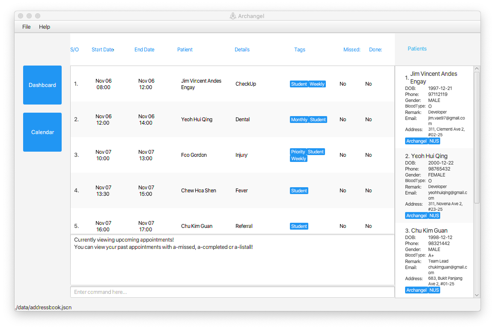

* This is **Archangel, an appointment management system for Psychiatrists**. 
* The project simulates an ongoing software project for a desktop application (called _Archangel_) used for managing appointment.
  * It is **written in OOP fashion**. It provides a **reasonably well-written** code base **bigger** (around 6 KLoC) than what students usually write in beginner-level SE modules, without being overwhelmingly big.
  * It comes with a **reasonable level of user and developer documentation**.
* It is named `Archangel` as it is the Psychiatrist's personal guide to their complex and delicate appointments.
* For the detailed documentation of this project, see the **[Archangel Product Website](https://ay2021s1-cs2103t-w11-1.github.io/tp/)**.
* This project is based on **AddressBook-Level3** project created by the  [SE-EDU initiative](https://se-education.org#https://se-education.org/#contributing) for more info.
