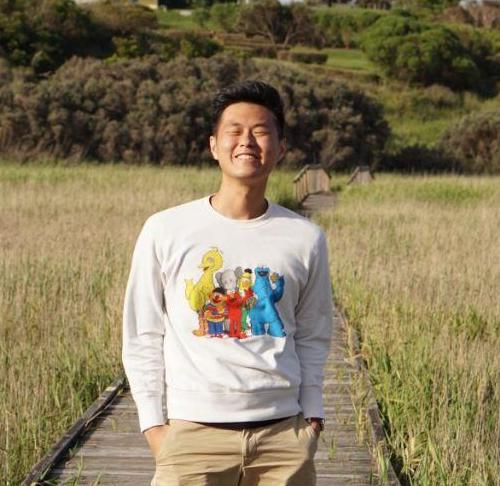
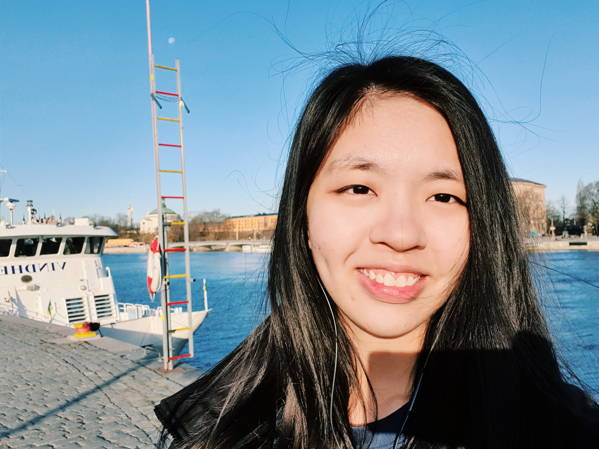
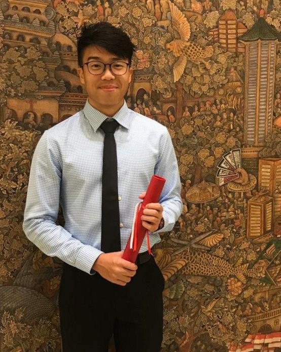

We are a team based in the [School of Computing, National University of Singapore](http://www.comp.nus.edu.sg).

You can reach us at the email `seer[at]comp.nus.edu.sg`

## Project team

### Chu Kim Guan

[[github](https://github.com/soaza)]
[[portfolio](team/soaza.md)]

* Role: Team Lead
* Responsibilities: Dev Ops

### Yeoh Hui Qing

[[github](http://github.com/yeohhq)]
[[portfolio](team/yeohhq.md)]

* Role: Developer
* Responsibilities: DevOps + Documentation

### Gordon Foo

[[github](http://github.com/gordonfgz)]
[[portfolio](team/gordonfgz.md)]

* Role: Developer
* Responsibilities: Dev Ops

### Jim Vincent Engay

[[github](http://github.com/jimvae)]
[[portfolio](team/jimvae.md)]

* Role: Developer
* Responsibilities: Ui + Testing

### Chew Hoa Shen

[[github](http://github.com/chshen1998)]
[[portfolio](team/chshen1998.md)]

* Role: Developer
* Responsibilities: Data + Threading

