* Table of Contents
{:toc}
--------------------------------------------------------------------------------------------------------------------
## **1. Introduction**
### 1.1 Purpose
This document describes the setting up, design, implementation, documentation of Archangel.

### 1.2 Audience
The whole documentation is in general for anyone who wants to understand the documentation and implementation
of Archangel. The following groups are the intended target of this documentation.

1. CS2101/CS2103T Teaching Team - to evaluate Archangel's software architecture, design,
implementation and documentation.
2. CS2103T Students - to understand Archangel's software architecture, design,
implementation and documentation in order to enhance and implement some of the features
inside the software.

### 1.3 How to use this guide
This Developer Guide is written in a top-down manner, starting with the overall architecture of Archangel, followed by in-depth descriptions of individual features implemented.  

To navigate to a specific section in this guide, you can click on individual headers in the **Table of Contents** at the top of this markdown document to jump to that section.
Within each section, we have also provided brief introductory statements where necessary.

--------------------------------------------------------------------------------------------------------------------

## **2. Setting up**

Refer to the guide [_Setting up and getting started_](SettingUp.md).

--------------------------------------------------------------------------------------------------------------------

## **3. Design**

### 3.1 Architecture

The ***Architecture Diagram*** given above explains the high-level design of Archangel. Given below is a quick overview of each component.

:bulb: **Tip:** The `.puml` files used to create diagrams in this document can be found in the [diagrams](https://github.com/AY2021S1-CS2103T-W11-1/tp/tree/master/docs/diagrams) folder. Refer to the [_PlantUML Tutorial_ at se-edu/guides](https://se-education.org/guides/tutorials/plantUml.html) to learn how to create and edit diagrams.

**`Main`** has two classes called [`Main`](https://github.com/AY2021S1-CS2103T-W11-1/tp/tree/master/src/main/java/seedu/address/Main.java) and [`MainApp`](https://github.com/AY2021S1-CS2103T-W11-1/tp/tree/master/src/main/java/seedu/address/MainApp.java). It is responsible for,
* At app launch: Initializes the components in the correct sequence, and connects them up with each other.
* At shut down: Shuts down the components and invokes cleanup methods where necessary.

[**`Commons`**](#common-classes) represents a collection of classes used by multiple other components.

The rest of Archangel consists of four components.

* [**`UI`**](#32-ui-component): The UI of Archangel.
* [**`Logic`**](#33-logic-component): The command executor.
* [**`Model`**](#34-model-component): Holds the data of Archangel in memory.
* [**`Storage`**](#35-storage-component): Reads data from, and writes data to, the hard disk.

Each of the four components,

* defines its *API* in an `interface` with the same name as the Component.
* exposes its functionality using a concrete `{Component Name}Manager` class (which implements the corresponding API `interface` mentioned in the previous point.

For example, the `Logic` component (see the class diagram given below) defines its API in the `Logic.java` interface and exposes its functionality using the `LogicManager.java` class which implements the `Logic` interface.

_Diagram 3.1.1 : Logic Class Diagram_  

**How the architecture components interact with each other**

The *Sequence Diagram* below shows how the components interact with each other for the scenario where the user issues the command `delete 1`.

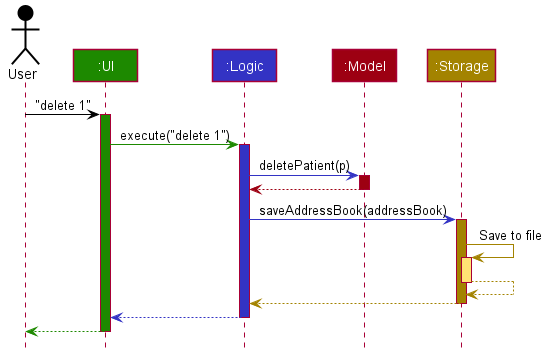
_Diagram 3.1.2 : Architecture Sequence Diagram_  

The sections below give more details of each component.

### 3.2 UI component

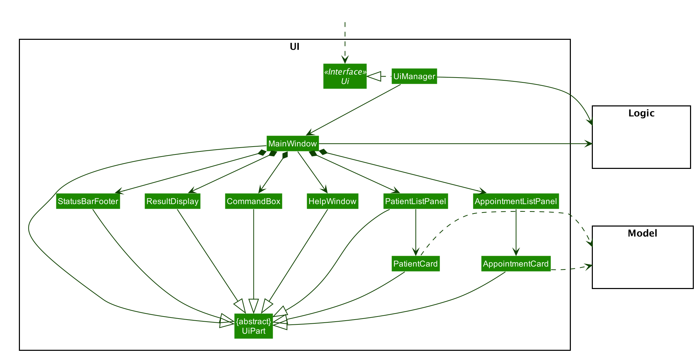
_Diagram 3.2 : UI Class Diagram_

**API** :
[`Ui.java`](https://github.com/AY2021S1-CS2103T-W11-1/tp/tree/master/src/main/java/seedu/address/ui/Ui.java)

The UI consists of a `MainWindow` that is made up of parts e.g.`CommandBox`, `ResultDisplay`, `PatientListPanel`, `AppointmentListPanel`, `StatusBarFooter` etc. All these, including the `MainWindow`, inherit from the abstract `UiPart` class.

The `UI` component uses JavaFx UI framework. The layout of these UI parts are defined in matching `.fxml` files that are in the `src/main/resources/view` folder. For example, the layout of the [`MainWindow`](https://github.com/se-edu/addressbook-level3/tree/master/src/main/java/seedu/address/ui/MainWindow.java) is specified in [`MainWindow.fxml`](https://github.com/se-edu/addressbook-level3/tree/master/src/main/resources/view/MainWindow.fxml)

The `UI` component,

* Executes user commands using the `Logic` component.
* Listens for changes to `Model` data so that the UI can be updated with the modified data.

### 3.3 Logic component

 
_Diagram 3.3.1 : Logic Class Diagram_  

**API** :
[`Logic.java`](https://github.com/AY2021S1-CS2103T-W11-1/tp/tree/master/src/main/java/seedu/address/logic/Logic.java)

1. `Logic` uses the `AddressBookParser` class to parse the user command.
2. This results in a `Command` object which is executed by the `LogicManager`.
3. The command execution can affect the `Model` (e.g. adding a patient).
4. The result of the command execution is encapsulated as a `CommandResult` object which is passed back to the `Ui`.
5. In addition, the `CommandResult` object can also instruct the `Ui` to perform certain actions, such as displaying help to the user.

Given below is the Sequence Diagram for interactions within the `Logic` component for the `execute("delete 1")` API call.

_Diagram 3.3.2 : Delete Sequence Diagram_ 

:information_source: **Note:** The lifeline for `DeleteCommandParser` should end at the destroy marker (X) but due to a limitation of PlantUML, the lifeline reaches the end of diagram.

### 3.4 Model component

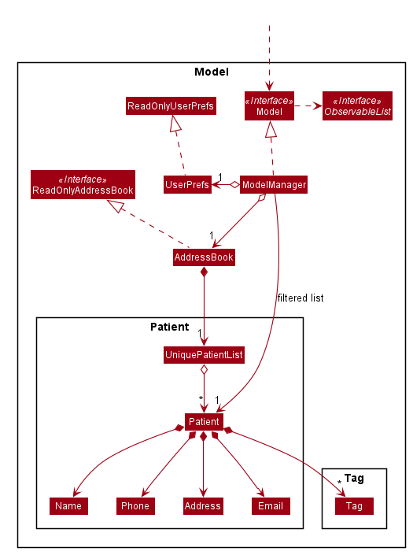 
_Diagram 3.4 : Model Class Diagram_  

**API** : [`Model.java`](https://github.com/AY2021S1-CS2103T-W11-1/tp/tree/master/src/main/java/seedu/address/model/Model.java)

The `Model`,

* stores a `UserPref` object that represents the user’s preferences.
* stores Archangel's data.
* exposes an unmodifiable `ObservableList<Patient>` that can be 'observed' e.g. the UI can be bound to this list so that the UI automatically updates when the data in the list change.
* does not depend on any of the other three components.

:information_source: **Note:** An alternative (arguably, a more OOP) model is given below. It has a `Tag` list in the `AddressBook`, which `Patient` references. This allows `AddressBook` to only require one `Tag` object per unique `Tag`, instead of each `Patient` needing their own `Tag` object. 
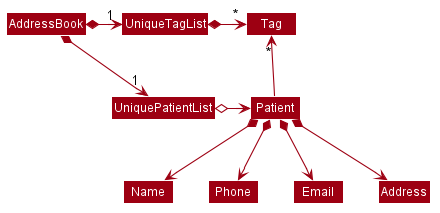

### 3.5 Storage component

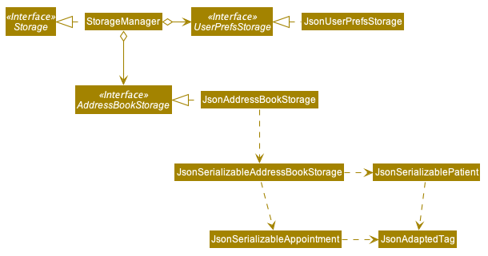 
_Diagram 3.5 : Storage Class Diagram_

**API** : [`Storage.java`](https://github.com/AY2021S1-CS2103T-W11-1/tp/tree/master/src/main/java/seedu/address/storage/Storage.java)

The `Storage` component,
* can save `UserPref` objects in json format and read it back.
* can save Archangel's data in json format and read it back.

### 3.6 Common classes

Classes used by multiple components are in the `seedu.addressbook.commons` package.

--------------------------------------------------------------------------------------------------------------------

## **4. Implementation**

As the previous Design section illustrated the general architecture of the app, this section aims to illustrate what happens at the deeper levels.
This section describes some noteworthy details on how certain features are implemented.

### 4.1 Patient Commands

##### 4.1.1 Before we dive in

It is important to know the architectural design of the app to be able to understand this section.
Please ensure that you have read section **3.3 Logic components** before diving deeper into this section as most implemented features make use of the same principles.

<!-- // Commented this out as it seems to be mostly repeating section 3.3
Here is a summary of the logic flow:
1. User inputs into command line
2. `LogicManager` handles the input, and calls `AddressBookParser`'s `parseCommand(String userInput)` method with the input as its argument.
3. `AddressBookParser`'s `parseCommand(String userInput)` method will create the respective `CommandParser` object and call its `parse(String args)` method with the input from the previous step.
4. This `parse(String args)` method mentioned above will carry out its tasks required for the specific command.
5. After the tasks are completed, the `parse(String args)` method will return a `Command` object to the `LogicManager` for execution.
6. `Command` object's `execute()` method will be called and the `Model` will be modified with the change determined by the user's input.
--->

#### 4.1.2 Structure of Patient Commands

The following diagram shows the overview of a generic patient command `PatientXYZCommand`, where `XYZ` could be `Add`, `Delete` etc. :
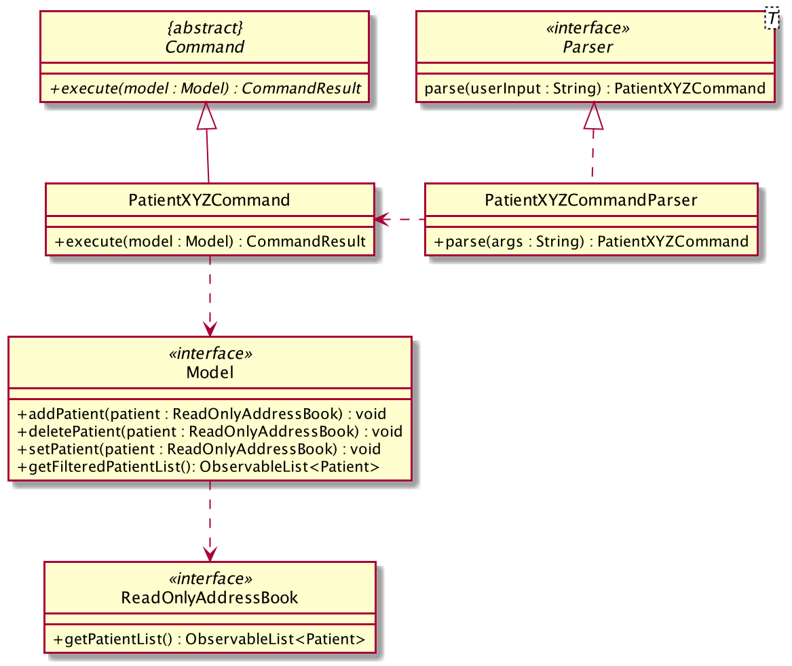 
_Diagram 4.1.2 : Patient Command Structure Diagram_

In each `PatientXYZCommand` class, there are static messages as follows:
* `COMMAND_WORD` - String denoting the command word `Parser` will check for to determine which type of command user input should invoke.
* `MESSAGE_USAGE` - String containing a input guide message for when user inputs are in incorrect formats.

<!--
##### 4.1.2 Focus

As the previous Design section illustrated the general architecture of the app, this section aims to illustrate what happens at the deeper levels.
This section will focus on what happens in the various command parsers, i.e. `AddCommandParser` , `EditCommandParser`.
This section will also focus on what happens when the respective commands are executed.
--->

#### 4.1.3 Add Patient

##### Implementation

The Add patient command has a highly similar logic and implementation as a Delete patient command (see Diagram 4.1.2 and 3.3.2).
The only notable difference is that an Add patient command does not require parsing of an `Index`. (i.e. `parse("1")` is not applicable)
  On execution, the `Patient` object stored in the `PatientAddCommand` object will be added to the Model.

<!--
The arguments of an Add command includes the necessary fields required to create a `Patient` object.

What happens at `AddCommandParser().parse(arguments)`:
1. The argument will be used to make an `ArgumentMultimap` object via the `ArgumentTokenizer.tokenize()` method.
2. As every field of a `Patient` is its respective object, the `AddCommandParser().parse(arguments)` method will use `ParserUtil`'s parse methods for each field to create the new respective field object.
3. Once all the field objects are created, a new `Patient` object is created with all the field objects as arguments for its constructor.
4. A `PatientAddCommand` object is created that stores the newly created `Patient` object, and it is returned to the `LogicManager`.
5. This `PatientEditCommand` object will be stored under the `command` variable and then be executed by the `LogicManager`.
6. At execution, the `Patient` object stored in the `PatientAddCommand` object will be added.

This is how Adding of Patients is implemented.
--->
#### 4.1.4 Delete Patient

##### Implementation

The arguments of a Delete patient command includes the `Index` of the Patient to be deleted (see Diagram 4.1.2 and 3.3.2).   
On execution, the `Index` object stored in the `PatientDeleteCommand` object will be used to locate the `Patient` object to be deleted from the Model.

<!--
What happens at `DeleteCommandParser().parse(arguments)`:
1. An `Index` object will be created by `ParserUtil`'s `parseIndex(args)` method.
2. A new `PatientDeleteCommand` object will be created, storing the `Index` object and it is then returned to the `LogicManager`.
3. This `PatientEditCommand` object will stored under the `command` variable and then be executed by the `LogicManager`.
4. At execution, the `Index` object stored in the `PatientDeleteCommand` object will be used to locate the `Patient` object to be deleted.
5. Located `Patient` object will be deleted.

This is how Deleting of Patients is implemented.
--->

#### 4.1.5 Edit Patient

_Diagram 4.1.5 : PatientEditCommand Sequence Diagram_

##### Implementation

With reference to Diagram 4.1.5 above, the arguments of an Edit patient command includes the `Index` of the Patient selected for changes and the `changes` the User wants to make to the individual fields of a single `Patient`.   

What happens at `EditCommandParser().parse(arguments)`:
1. An `EditPatientDescriptor` object is first created. An `EditPatientDescriptor` object contains all fields that a `Patient` has and acts as a placeholder for the changes.
2. For each field input present in the argument, that respective field of the `EditPatientDescriptor` object will be set accordingly.
PatientFindCommand This object contains the `Index` of the `Patient` selected for changes, and the `EditPatientDescriptor` object created in Step 1 and fully modified by Step 2.
4. This `PatientEditCommand` object will stored under the `command` variable and then be executed by the `LogicManager`.
5. At execution, an `editedPatient` object will be created. This `editedPatient` object contains all fields that a Patient has and acts as a placeholder for both the changes from the `EditPatientDescriptor` object and unchanged fields of the original `Patient`.
6. Since the `editedPatient` object will contain the corrected set of fields to be reflected on the original Patient, the `PatientEditCommand` will replace the current `Patient` object with the `editedPatient` object.

This is how Editing of Patient information is implemented.

#### 4.1.6 Find Patient

##### Implementation

The arguments of a Find patient command includes the `Keywords` that the User wants to search up. `Keywords` are seperated by spaces.

What happens at `FindCommandParser().parse(arguments)`:
1. `Keywords` are put into an `nameKeywords` array.
2. A new `SearchNameFilter` object is created with the `nameKeywords` array converted to a List.
3. A new `PatientFindCommand` object is created with the `SearchNameFilter` object, and it is then returned to the `LogicManager` for execution.
4. At execution, a list filtered with only those that are related to the `Keywords` is shown.

This is how Find Patient is implemented.

--------------------------------------------------------------------------------------------------------------------
### 4.2 Appointment Commands

In this section, we will introduce all Appointment-type commands and how they work.
Due to similar implementation of Appointment-type and Patient-type commands
(e.g. `p-edit` and `a-edit` make use of the same logic), we will be referring to the patient-type counterpart of the same command where applicable.
Any noteworthy details will still be included under each Appointment-type command below.

#### 4.2.1 Schedule Appointment

##### 4.2.1.1 Implementation
The implementation of scheduling an appointment has a similar execution as adding a patient (see 4.1.3).
Take note that backdated appointments are allowed (i.e. appointments scheduled before current time) to be able to digitise existing appointment records from clinics.

<!--
The user's input is parsed by the `ScheduleAppointmentCommandParser` class which extends `Parser`, resulting in an `AppointmentScheduleCommand` which extends `Command`.
Subsequently, the `LogicManager` executes the `AppointmentScheduleCommand` object to schedule an appointment.
--->

The `Appointment` class stores relevant fields (e.g. `AppointmentTime`, `Description`) and the `Patient`, **and/or** a string representing the patient's index in the `ObservableList<Patient>`, depending on which constructor is invoked during execution.

##### 4.2.1.2 Reason for design of implementation:
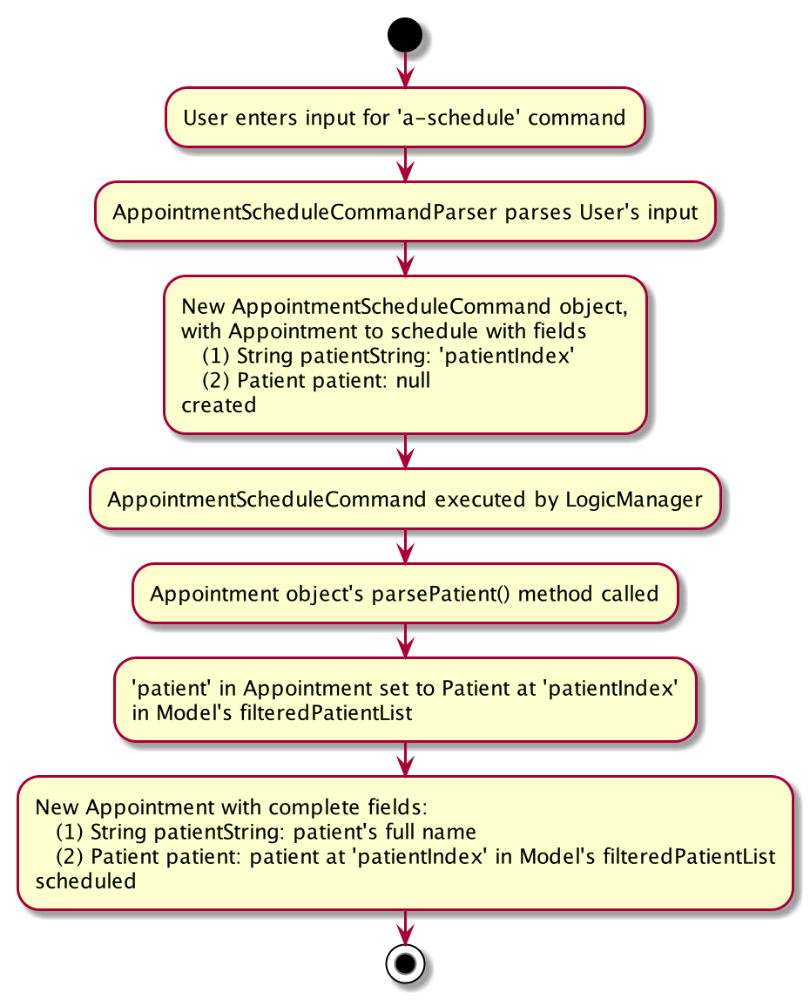 
_Diagram 4.2.1.2 : AppointmentScheduleCommand Activity Diagram_

The reason for having 2 `Appointment` constructors is to improve the ease of scheduling an appointment by the user using the CLI.

To address the problem of mandatory fields being highly time-consuming, we have decided to allow users to simply input a `patientIndex` to identify the patient from the visible `ObservableList<Patient>` without being concerned with typing the exact name or details of the desired patient to assign to the `Appointment`.

##### 4.2.1.3 Design consideration:

###### Aspect: How `Patient` is stored in an `Appointment` object
* **Alternative 1 (current choice):** Saves the `Patient` object and/or the `patientIndex` String
  * Pros:
    * Easy to implement, gives a less stringent check for `isSameAppointment` for other Appointment-type commands (e.g. `AppointmentEditCommand`).
    * This allows for creation of `Appointment` objects which are not duplicates yet have the same `Patient` and/or `patientIndex` during command execution.
  * Cons: More test cases necessary to ensure that `patientIndex` is correctly parsed and retrieved from patient list in `AddressBook`.

* **Alternative 2:** Saves only the `Patient` object after parsing the `patientIndex` String
  * Pros: No extra parsing/handling of `Patient` once `Appointment` object has been created.
  * Cons: Difficult to edit the patient-field in an `Appointment` object as all fields of the `Patient` object itself must be present.

#### 4.2.2 Delete Appointment

##### Implementation
The implementation of deleting an appointment has a similar execution as deleting a patient (see 4.1.4).

<!--
The user's input is parsed by the `DeleteAppointmentCommandParser` class which extends `Parser`, resulting in an `AppointmentDeleteCommand` which extends `Command`.
Subsequently, the `LogicManager` executes the `AppointmentDeleteCommand` object to delete the appointment with the given index in `ObservableList<Appointment>`.
--->

#### 4.2.3 Edit Appointment

##### 4.2.3.1 Implementation
The implementation of editing an appointment has a similar execution as editing a patient (see 4.1.5). Take note that backdated appointments are allowed to be able to digitise existing appointment records from clinics .

<!--
The user's input is parsed by the `EditAppointmentCommandParser` class which extends `Parser`, resulting in an `AppointmentEditCommand` which extends `Command`.
Subsequently, the `LogicManager` executes the `AppointmentEditCommand` object to edit the appointment with the given index in `ObservableList<Appointment>`.
--->

##### 4.2.3.2 Reason for design of implementation:
The reason for having an `EditAppointmentDescriptor` is to enforce immutability by always creating the edited appointment as a new `Appointment` object.

##### 4.2.3.3 Design consideration:

###### Aspect: How `Patient` is edited in an `Appointment` object
* **Alternative 1 (current choice):** Edits the `Patient` in the `Appointment` using a `patientIndex` String (e.g. `a-edit 1 pt/2`)
  * Pros: Easy for users to change the patient for the appointment using a single `patientIndex`.
  * Cons: `patientIndex` has to be carefully parsed and retrieved from a patient list that correctly reflects the patient list on the GUI.

* **Alternative 2:** Edits the `Patient` in the `Appointment` by `patientName` (e.g. `a-edit 1 pt/John Doe`)
  * Pros: None.
  * Cons: Greater difficulty for users to input the new `Patient` since the `patientName` may not be unique nor accurate to an existing patient in the patient list.

#### 4.2.4 Complete Appointment

##### Implementation
Sets a specified appointment as completed. The implementation of setting an appointment as completed has a similar
execution as editing as appointment (see 4.2.3).

The unique classes associated to this command are :
1. `AppointmentCommandParser: AppointmentCompleteCommandParser`— Creates a new AppointmentCompleteCommand object.
2. `AppointmentCommand: AppointmentCompleteCommand`— Identifies the specified appointment from list and passes it to ModelManager to set as completed.

#### 4.2.5 Filter Appointment Commands

##### 4.2.5.1 Structure

Commands involving filtering of the appointment work similarly by using filters to obtain the appointments needed. For this section, we will be exploring `AppointmentFindPatientCommand` which filters Appointments containing Patients whose name includes the given user input.
The Command, Parser and Predicate in the class diagram below can be replaced by different sets of values from Diagram 4.2.5.1b.
 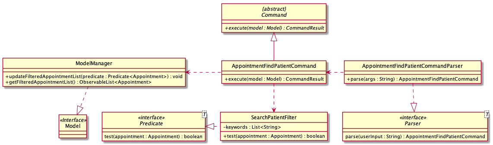
_Diagram 4.2.5.1a : Appointment Commands with Filters Class Diagram_

Filter Appointment Commands including both its Parser and Predicate are listed below:

| Command                          | Parser                              | Predicate                        | Filters List by:                 |
|----------------------------------|-------------------------------------|----------------------------------|----------------------------------|
| 1. AppointmentFindPatientCommand | AppointmentFindPatientCommandParser | SearchPatientFilter              | Patient Name                     |
| 2. AppointmentTodayCommand       | AppointmentTodayCommandParser       | SearchAppointmentTodayFilter     | Appointments occurring today     |
| 3. AppointmentWeekCommand        | AppointmentWeekCommandParser        | SearchAppointmentWeekFilter      | Appointments occurring this week |
| 4. AppointmentTagCommand         | AppointmentTagCommandParser         | SearchAppointmentTagsFilter      | Appointment Tag                  |
| 5. AppointmentIsMissedCommand    | AppointmentMissedCommandParser      | SearchAppointmentMissedFilter    | Missed Appointments              |
| 6. AppointmentIsCompletedCommand | AppointmentIsCompletedCommandParser | SearchAppointmentCompletedFilter | Completed Appointments           |
| 7. AppointmentListCommand        | AppointmentListCommandParser        | SearchAppointmentFilter          | Pending Appointments             |

_Diagram 4.2.5.1b : Appointment Commands with Filters Class Diagram_

##### 4.2.5.2 Implementation
The search for appointment by patient name works by filtering the appointment list to show only those appointments with
the given patient name.

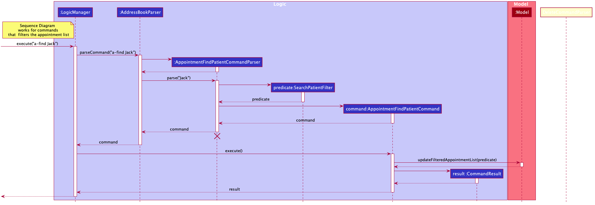  
_Diagram 4.2.5.2 : Appointment Commands with Filters Sequence Diagram_

The unique classes associated to `AppointmentFindPatientCommand`  command:
1. `AppointmentFindPatientCommandParser`— Parses input arguments and creates a new AppointmentFindPatientCommand object.
2. `SearchPatientFilter`— Checks if the appointment contains any patient which contains any keywords form the arguments.
3. `AppointmentFindPatientCommand`— Applies the filter to the appointment list.

The implementation of all listing filter appointment commands have a similar execution as `AppointmentFindPatientCommand`.

##### 4.2.5.3 Design considerations
* **Alternative 1 (current choice):** Store the appointments by date added.
  * Pros: Easy to implement and less overhead operations when using adding appointments.
  * Cons: May not be the fastest way to search for appointments.

* **Alternative 2:** Store the appointments by tags and search the dates by Binary Search.
  * Pros: Search operation for this is faster.
  * Cons: Additional overhead every time you add an appointment as you need to know where to insert the command.
  You also need to update the sequence of storage file by tag every time you schedule an appointment. In addition,
  there might be a conflict for those appointments with more than one tags.

#### 4.2.6 List All Appointments
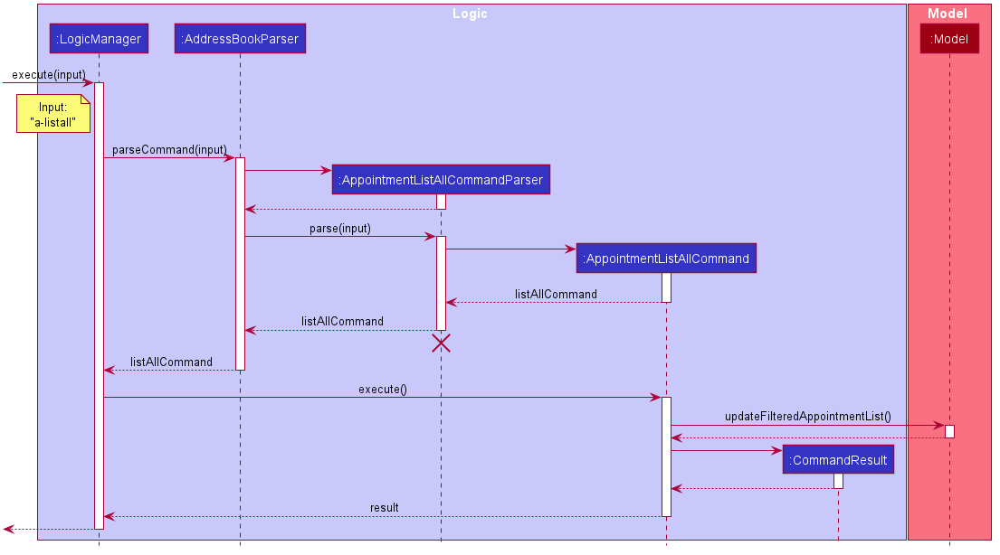
_Diagram 4.2.6 : Appointment List All Command Sequence Diagram

##### Implementation
Listing all past and upcoming appointments from the appointment list.

The unique classes associated to this command as shown from Diagram 4.2.6 are :
1. `AppointmentCommandParser: AppointmentListAllCommandParser`— Creates a new AppointmentListAllCommand object.
2. `AppointmentCommand: AppointmentListAllCommand`— Updates filtered appointment list to show all appointments in Archangel.

--------------------------------------------------------------------------------------------------------------------

### 4.3 Supporting Commands

#### 4.3.1 Undo/redo feature

##### Implementation

The proposed undo/redo mechanism is facilitated by `UserHistoryManager`. It extends `AddressBook` with an undo/redo history, stored internally in `userHistory` as  `Stack<Pair<List<Patient>, List<Appointment>>>`. Additionally, it implements the following operations:

* `UserHistoryManager#addHistory()` — Saves the current address book state in its history.
* `UserHistoryManager#undoHistory()` — Restores the previous address book state from its history.
* `UserHistoryManager#redoHistory()` — Restores a previously undone address book state from its history.

These operations are exposed in the `ModelManager` class as `ModelManager#getUserHistoryManager()`, `ModelManager#undoHistory()` and `Model#redoHistory()` respectively.

Given below is an example usage scenario and how the undo/redo mechanism behaves at each step.

Step 1. The user launches the application for the first time. The `UserHistoryManager` will be initialized with the initial address book user history in the stack.

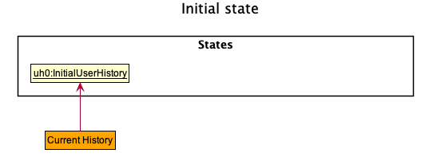

Step 2. The user executes `delete 5` command to delete the 5th patient in the address book. The `delete` command calls `UserHistoryManager#addHistory()`, causing its current history to be saved into `UserHistory` in `UserHistoryManager` after the `delete 5` command.

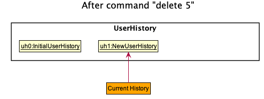

Step 3. The user executes `add n/David …​` to add a new patient. The `add` command also calls `UserHistoryManager#addHistory()`, causing its current history to be saved into `UserHistory` in `UserHistoryManager`.

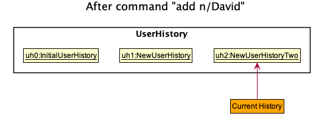

:information_source: **Note:** If a command fails its execution, it will not call `UserHistoryManager#addHistory()`, so the address book state will not be saved into the `userHistoryManager`.

Step 4. The user now decides that adding the patient was a mistake, and decides to undo that action by executing the `undo` command. The `undo` command will call `Model#undoHistory()`, which will cause call `UserHistoryManager#undoHistory()`,popping the `userHistory` stack, adding the current history to `redoHistory` and removing the current history from `UserHistory`.
`AddressBook#setPatients` and `AddressBook#setAppointments` will be called, modifying the `AddressBook` and undo-ing the history.

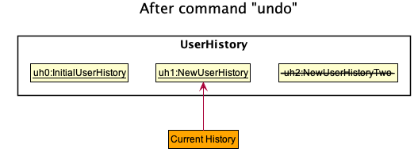

:information_source: **Note:** If the `Current History` has a size of 1, having only the initial history, then there are no previous AddressBook history to restore. The `undo` command uses `Model#canUndoAddressBook()` to check if this is the case. If so, it will return an error to the user rather
than attempting to perform the undo.

The following sequence diagram shows how the undo operation works:

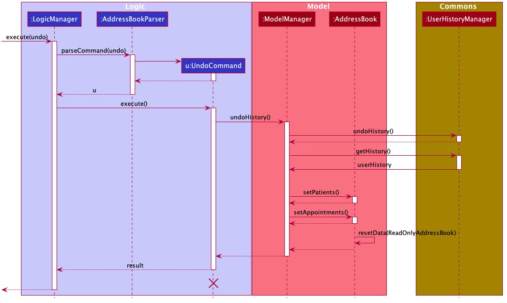

:information_source: **Note:** The lifeline for `UndoCommand` should end at the destroy marker (X) but due to a limitation of PlantUML, the lifeline reaches the end of diagram.

The `redo` command does the opposite — it calls `Model#redoHistory()`, which calls `UserHistoryManager#redoHistory()`, popping the `redoHistory` stack,modifying the `AddressBook` and redo-ing the history.

Step 5. The user then decides to execute the command `a-list`. Commands that do not modify the address book, such as `a-list`, will usually not call `Model#undoHistory()` or `Model#redoHistory()`. Thus, the `UserHistory` remains unchanged.

The following activity diagram summarizes what happens when a user executes a new command:

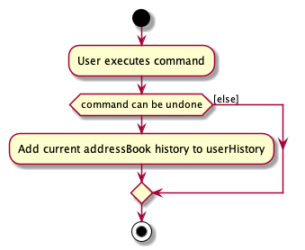

##### Reason for design of implementation:
The reason for the design of userHistory using a stack is due to the functionality of `undoHistory()`. We want to be able undo the latest changes to the `UniquePatientList` or `UniqueAppointmentList`.
This follows the `Last In,First Out(LIFO)` design which can be implementated using the `stack` data structure.

A concern using this design is that the memory usage might be undesirable due to the large of memory usage needed to store every user history at each command.
However, after many test runs, we concluded that the memory usage of the user history was insignificant and thus this design can be safely implememented with no drawbacks.

##### Design consideration:

* This command does not work with filter commands (`a-completed`,`a-missed`,`a-upcoming`,`a-today`,`a-find`,`a-list`)
  as its implementation purpose is to assist the user in undo-ing his changes, filter commands do not make changes to the data.
  It also does not work with `p-edit` as the design requires patient details to be accurate as of time schedule, such that the
  records can accurately reflect the patient's conditions at the time of the appointment.With this concern in mind, we disabled `undo` for `p-edit` and the user can simply execute another `p-edit` command to undo
  his changes.

###### Aspect: How undo & redo executes

* **Alternative 1 (current choice):** Saves the entire address book.
  * Pros: Easy to implement.
  * Cons: May have performance issues in terms of memory usage.

* **Alternative 2:** Individual command knows how to undo/redo by
  itself.
  * Pros: Will use less memory (e.g. for `delete`, just save the patient being deleted).
  * Cons: We must ensure that the implementation of each individual command are correct.

* **Alternative 3:** Individual command is contained in a `reversible-pair-action` class. When we want to `undo`, we can just call its `pair command`.
  * Pros: Will use less memory (due to the fact that are not saving any additional data).
  * Cons: Very difficult to implement, some commands might not have `pair command`(e.g for `edit`, it is own pair command but pair command to call for undo is hard to implement).

--------------------------------------------------------------------------------------------------------------------

### 4.4 Multi-threading

#### 4.4.1 Timer Thread

##### Implementation

The TimerThread is a separate thread used for automatic tracking of missed appointments, and is initiated by MainApp.

Here is a summary of how the Timer Thread work:
1. On initialization, `MainApp` creates an instance of `TimerThread` and calls it's `run()` method to being running the
thread.
2. While `TimerThread` is running, it sleeps for 1 minute using the `Thread.sleep` method.
3. After sleeping, `TimerThread` will call `LogicManager`'s `checkNewlyMissedAppointments`, which in turn will call
`AddressBookParser` to `parseCommand("a-new-misses"))`.
3. `AddressBookParser`'s `parseCommand("a-new-misses")` method will create a `NewMissesCommandParser` object and call
its `parse()` method.
4. This `parse()` method mentioned above will create a `AppointmentNewMissesCommand`.
5. The `parse()` method will return a `AppointmentNewMissesCommand` object to the `LogicManager` for execution.
6. `AppointmentNewMissesCommand` object's `execute()` method will be called and within `Model`, every `Appointment`
which end time has been passed by 30 minutes will be labelled as missed.
7. Steps 2 to 6 will repeat until the application is closed.
8. On closing the application, `MainApp` calls the `TimerThread` object's `setStop()` method which will break the thread
out of the loop.

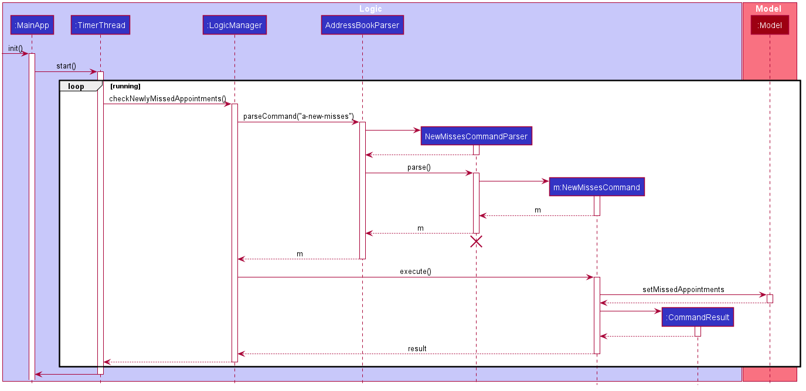

##### Reason for design of implementation:

The reason for having a timer on a separate thread from the main app functionality to avoid any conflicts with the manual
commands input from the user.

For ease of use, the user is not required to input any command for the `TimerThread` to run.

##### Design consideration:

* **Alternative 1 (current choice):** Refresh for new misses in 1 minute intervals.
  * Pros: Less behind the scenes computation overhead, allowing for a smoother user experience.
  * Cons: Appointments may be labelled missed up to a minute late. However, this is a minor inconvenience and most
  likely will not be noticed by the user.

* **Alternative 2:** Refresh for new misses in 10 second intervals.
  * Pros: Appointments will be guaranteed to be correctly labelled.
  * Cons: Additional computation overhead, leading to slower application perform. This problem will be emphasized even
  greater as more appointments are stored.

--------------------------------------------------------------------------------------------------------------------

## **5. Documentation, logging, testing, configuration, dev-ops**

* [Documentation guide](Documentation.md)
* [Testing guide](Testing.md)
* [Logging guide](Logging.md)
* [Configuration guide](Configuration.md)
* [DevOps guide](DevOps.md)

--------------------------------------------------------------------------------------------------------------------

## **6. Appendix: Requirements**

### 6.1 Product scope

**Target user profile**:

* has a need to manage a significant number of patient's contacts/details
* has a preference to check his schedule on desktop over handwritten schedule
* has a need to store patient's information on desktop
* prefer desktop apps over other types
* can type fast
* prefers typing to mouse interactions
* is reasonably comfortable using CLI apps

**Value proposition**: provide an application for psychiatrists to manage their patient's medical information and their upcoming appointments.

### 6.2 User stories

Priorities: High (must have) - `* * *`, Medium (nice to have) - `* *`, Low (unlikely to have) - `*`

| Priority | As a …​          | I want to …​                                   | So that I can…​                                                        |
| -------- | --------------- | --------------------------------------------- | --------------------------------------------------------------------- |
| `* * *`  | Psychiatrist    | view the appointment history of my patient    | decide when I can schedule the next appointment for the patient.      |
| `* * *`  | Psychiatrist    | delete full patient records                   | remove any irrelevant patient records                                 |
| `* * *`  | Psychiatrist    | record details about the patient              | access his/her psychotherapy progress.                                |
| `* * *`  | Psychiatrist    | view my patient’s medical information         | access the type and dosage of medication to provide.                  |
| `* * *`  | Psychiatrist    | view my patient’s contact information         | contact them for their appointments.                                  |
| `* * *`  | Psychiatrist    | store my patient’s reviews/preference         | alter the treatment plan to suit his preferences.                     |
| `* *`    | Psychiatrist    | search my appointment list by patient name    | access see his progress across his appointments.                      |
| `* *`    | Psychiatrist    | search my appointment list by tags            | see the trend of patients from similar groups.                        |
| `* *`    | Psychiatrist    | search my appointment list by current day     | access only the appointments scheduled today.                         |
| `* *`    | Psychiatrist    | search my appointment list by current week    | view my whole schedule this week.                                     |

*{More to be added}*

### 6.3 Use cases

(For all use cases below, the **System** is `Archangel` (the AddressBook) and the **Actor** is the `user`, unless specified otherwise)

**Use case: UC1 -  Add a patient**

**MSS**

1.  User requests to add a new patient to the list.
2.  Archangel adds the patient.

    Use case ends.

**Extensions**

* 1a. The patient already exists in the list.

    * 1a1. Archangel shows duplicate patient error message.

      Use case resumes at step 1.

* 1b. User inputs are invalid/incomplete.

    * 1b1. Archangel shows an error message.

      Use case resumes at step 1.

**Use case: UC2 - Delete a patient**

**MSS**

1.  User requests to list patients.
2.  Archangel shows a list of patients.
3.  User requests to delete a specific patient in the list.
4.  Archangel deletes the patient.

    Use case ends.

**Extensions**

* 2a. The list is empty.

  Use case ends.

* 3a. The given index is invalid.

    * 3a1. Archangel shows an error message.

      Use case resumes at step 2.

**Use case: UC3 - Edit a patient**

**MSS**

1.  User requests to find a patient.
2.  Archangel shows the patient's information.
3.  User requests to edit the patient's information.
4.  Archangel edits the patient's information.

    Use case ends.

**Extensions**

* 1a. The patient is not found.

    * 1a1. Archangel shows an error message.

      Use case ends.

* 3a. The patient is not found.

    * 3a1. Archangel shows an error message.

      Use case resumes at step 2.

* 3b. User inputs fields that are invalid/does not satisfy requirements.

    * 3b1. Archangel shows an error message.

      Use case resumes at step 2.

**Use case: UC4 - Schedule a patient appointment**

**MSS**

1.  User requests to schedule a patient appointment.
2.  Archangel schedule the patient appointment.

    Use case ends.

**Extensions**

* 1a. The appointment has conflict with another appointment.

    * 1a1. Archangel shows an error message.

      Use case resumes at step 1.

* 1b. The appointment's date/timing is invalid.

    * 1b1. Archangel shows an error message.

      Use case resumes at step 1.

* 1c. The patient to be added to the appointment does not exist.

    * 1c1. Archangel shows an error message.

      Use case resumes at step 1.

**Use case: UC5 - Delete a patient appointment**

**MSS**

1.  User requests to delete a specific appointment in the list.
2.  Archangel deletes the appointment.

    Use case ends.

**Extensions**

* 1a. The appointment does not exist.

    * 1a1. Archangel shows an error message.

      Use case resumes at step 1.

* 1b. The appointment list is empty.

    * 1a1. Archangel shows an error message.

      Use case resumes at step 1.

**Use case: UC6 - Edit an appointment**

**MSS**

1.  User requests to edit the appointment's information.
2.  Archangel edits the appointment's information.

    Use case ends.

**Extensions**

* 1a. The appointment is not found.

    * 1a1. Archangel shows an error message.

      Use case ends.

* 1b. User inputs fields that are invalid/does not satisfy requirements.

    * 1b1. Archangel shows an error message.

      Use case resumes at step 1.

**Use case: UC7 - Complete an appointment**

**MSS**

1.  User requests to set an appointment as completed.
2.  Archangel sets the appointment as completed.

    Use case ends.

**Extensions**

* 1a. The appointment is not found.

    * 1a1. Archangel shows an error message.

      Use case ends.

* 1b. The appointment list is empty.

    * 1a1. Archangel shows an error message.

      Use case resumes at step 1.

**Use case: UC8 - Filter appointment list to find the upcoming appointments**

**MSS**

1.  User requests to view only upcoming appointments.
2.  Archangel displays only upcoming appointments in the dashboard.

    Use case ends.

**Extensions**

* 1a. User chose to view in the calendar tab.

    * 1a1. Archangel shows the upcoming appointments in calendar format.

      Use case ends.
      
**Use case: UC9 - Filter appointment list to find the appointments occuring today**
This case is similar to UC8, without the Extensions.

**Use case: UC10 - Filter appointment list to find tagged appointments**

**MSS**

1.  User requests to view only tagged appointments with their input keywords.
2.  Archangel displays tagged appointments matching the keywords

    Use case ends.

**Extensions**

* 1a. The keywords did not match any tags.

    * 1a1. Archangel was not able to list down any appointments.

      Use case ends.

**Use case: UC11 - Filter appointment list by patients**
This case is similar to UC10, with the filter being the patient name.

**Use case: UC12 - Undo command**

**MSS**

1.  User requests to undo a previous command.
2.  Archangel reverts back to state before previous command.

    Use case ends.

**Extensions**

* 1a. User has not executed any undo-able commands.

    * 1a1. Archangel shows an error message.

      Use case ends.

**Use case: UC13 - Redo command**

**MSS**

1.  User requests to redo a command that was undone.
2.  Archangel reverts back to state before undo command.

    Use case ends.

**Extensions**

* 1a. User has not undone any command.

    * 1a1. Archangel shows an error message.

      Use case ends.

**Use case: UC14 - Close Archangel program**

**MSS**

1.  User finishes using Archangel program.
2.  User closes the program.

    Use case ends.

**Extensions**

* 1a. The user does not close the program using the correct command/action.

    * 1a1. Archangel continues to run.

      Use case ends.

### 6.4 Non-Functional Requirements

1.  Should work on any _mainstream OS_ as long as it has Java `11` or above installed.
2.  Should be able to hold up to 1000 patients without a noticeable sluggishness in performance for typical usage.
3.  A user with above average typing speed for regular English text (i.e. not code, not system admin commands) should be able to accomplish most of the tasks faster using commands than using the mouse.
4.  Should be able to schedule up to 100 appointments per patient without a noticeable sluggishness in performance for typical usage.

*{More to be added}*

### 6.5 Glossary

* **Mainstream OS**: Windows, Linux, Unix, OS-X

--------------------------------------------------------------------------------------------------------------------

## **7. Appendix A: Instructions for manual testing**

Given below are instructions to test the app manually.

:information_source: **Note:** These instructions only provide a starting point for testers to work on;
testers are expected to do more *exploratory* testing.

### 7.1 Launch and shutdown

1. Initial launch

   1. Download the jar file and copy into an empty folder

   1. Double-click the jar file Expected: Shows the GUI with a set of sample contacts. The window size may not be optimum.

1. Saving window preferences

   1. Resize the window to an optimum size. Move the window to a different location. Close the window.

   1. Re-launch the app by double-clicking the jar file. 
       Expected: The most recent window size and location is retained.

1. _{ more test cases …​ }_

### 7.2 Deleting a patient

1. Deleting a patient while all patients are being shown

   1. Prerequisites: List all patients using the `list` command. Multiple patients in the list.

   1. Test case: `delete 1` 
      Expected: First contact is deleted from the list. Details of the deleted contact shown in the status message. Timestamp in the status bar is updated.

   1. Test case: `delete 0` 
      Expected: No patient is deleted. Error details shown in the status message. Status bar remains the same.

   1. Other incorrect delete commands to try: `delete`, `delete x`, `...` (where x is larger than the list size) 
      Expected: Similar to previous.

1. _{ more test cases …​ }_

### 7.3 Saving data

1. Dealing with missing/corrupted data files

   1. _{explain how to simulate a missing/corrupted file, and the expected behavior}_

2. _{ more test cases …​ }_

### 8. Appendix B: Effort

#### 8.1 Difficulty Level
Archangel is a brown-field project that has modified and improved features from the original AB3. Our Archangel project implements features for 2 main entities/models, namely Appointments and Patients. 
The inclusion of the Appointment model has increased the functionality and difficulty of the project compared to AB3 which only had Persons. 
Additionally, our team also explored the use of other external features such as iCalendarAgenda to improve the usability of our application.

#### 8.2 Challenges Faced
As more features were implemented, we faced challenges that arose from the dependencies between the Appointment and Patient classes in order to make Archangel's functionalities more user-centric and convenient for users (e.g. Deleting a patient also results in deletion of Appointment to reduce obsolete data). 
Many of the bugs we encountered at the beginning of the project were also due to unfamiliarity with the code base, but as time went by, identified bugs have been resolved to result in the Archangel application today.

### 9. Acknowledgments

#### 9.1 Code Related
1. Implementation of Calendar feature using iCalendarAgenda
   Credits to  [Tae Kwon](https://github.com/ktaekwon000) from CS2103T-W11-4 for sharing his code base and knowledge
   of iCalendarAgenda.
1. Implementation of Tabs in the UI is inspired by [KeepToo Youtube Channel](https://www.youtube.com/watch?v=ZVtys3GgkMo)
