* Table of Contents
{:toc}

--------------------------------------------------------------------------------------------------------------------

## 1. Introduction

Archangel is a desktop application for managing patient appointments  designed for usage by private clinic doctors, optimized for use via a Command Line Interface (CLI) while still having the benefits of a Graphical User Interface (GUI).   
Archangel integrates storing of patient data and scheduling patient appointments in a single application.
It supports adding, editing, deleting of patients/appointments and facilitates search using filter commands to help improve your experience in handling patient data. For those familiar with command line interfaces, Archangel can get your patient management appointment done faster than traditional GUI apps.

### 1.1 Archangel User Interface
You will be using the interface displayed below when using Archangel. It consists of a "Main Dashboard" tab and a "Calendar" Tab.

Main dashboard tab:
   * **Appointment List**: Shows the list of appointments that are scheduled.
   * **Patient List**: Shows the list of patients that are stored within Archangel.
   * **Status Box**: Displays the response of Archangel for commands that are entered by the user.
   * **Command Box**: Input box for the user to enter their commands.
   
Calendar tab:
   * **Calendar**: Shows the list of appointments that are scheduled within the current week in an in-built Calendar.
   * **Patient List**: Shows the list of patients that are stored within Archangel.

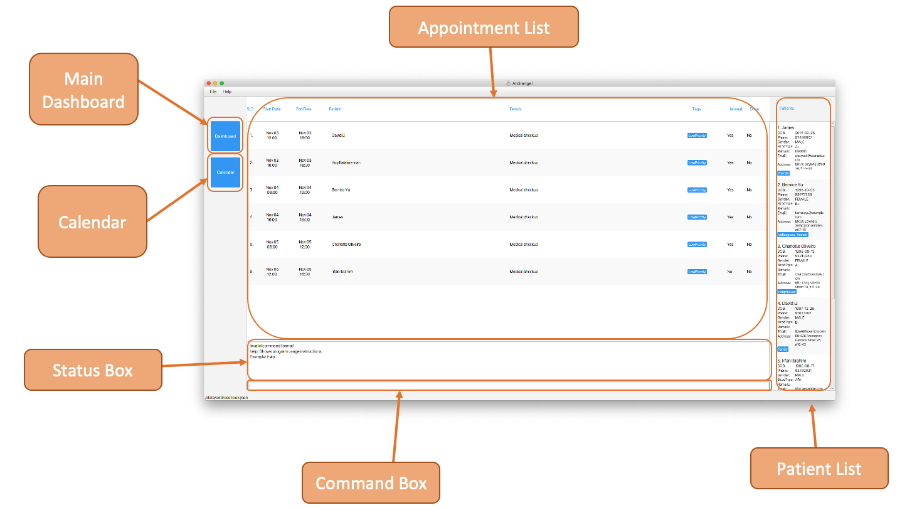  
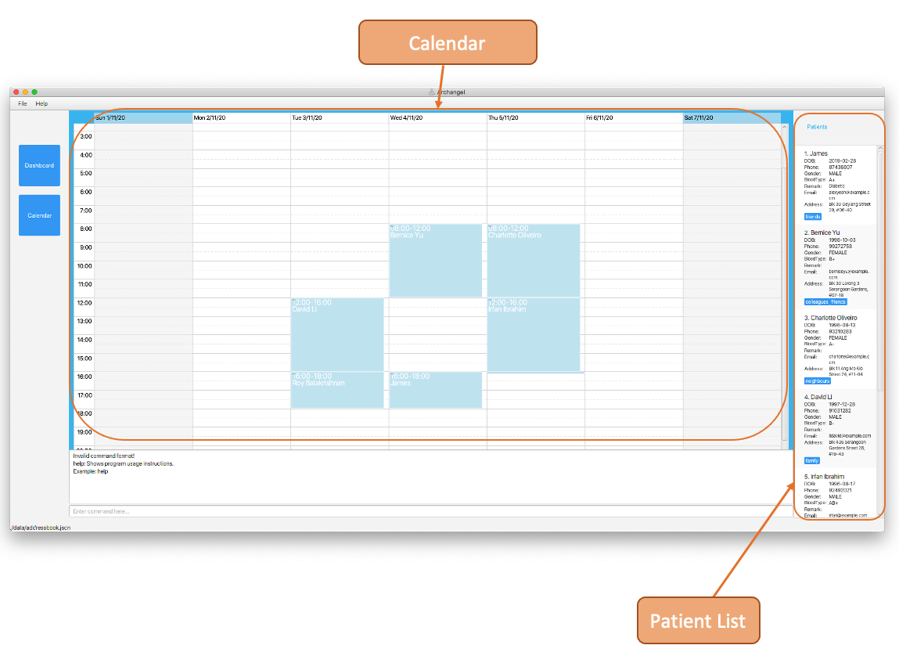  
Figure 1: <i>The user interface of Archangel.</i>

### 1.2 User Guide Icons

These are icons that are used throughout this User Guide for better readability:
- :bulb: — A useful tip for the users when using Archangel.
- :information_source: — A point for users to take note of.
- `code` — Indicates commands that will be typed into the <i>command box</i> 

### 1.3 Quick start

1. Ensure you have Java 11 or above installed in your Computer.

2. Download the latest `archangel.jar` from [here](https://github.com/AY2021S1-CS2103T-W11-1/tp/releases).

3. Copy the file to the folder you want to use as the _home folder_ for Archangel.

4. Double-click the file to start the app. The GUI similar to the below should appear in a few seconds. Note how the app contains some sample data. 
   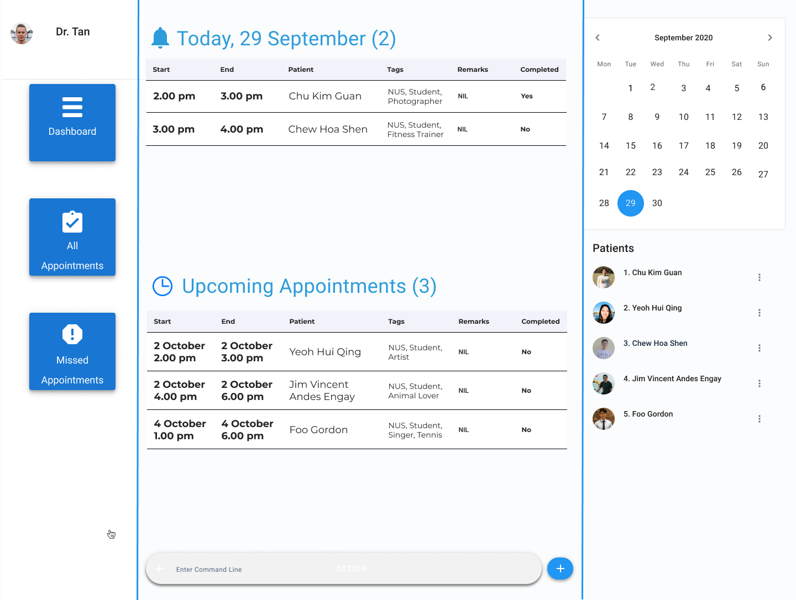     

5. Type the command in the command box and press `Enter` to execute it. e.g. typing `help` and pressing `Enter` will open the help window. 
   Some example commands you can try:

   * `p-list` : Lists all patients.

   * `p-add n/John Doe g/MALE bd/2018-12-27 bt/A+ p/98765432 e/johnd@example.com a/311, Clementi Ave 2, #02-25` : Adds a Patient named John Doe to the Archangel.

   * `p-delete 3` : Deletes the 3rd patient shown in the current list.

   * `exit` : Exits the app.
   
   

:information_source: **Things to Note:**   
* For Mac users, you might get an error as shown in the image below when opening the `archangel.jar`, you can refer to the [FAQ](#faq) for more information.  
      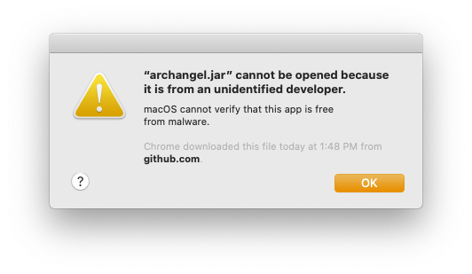     

--------------------------------------------------------------------------------------------------------------------

## 2. Features

### 2.1 General Features

**:information_source: Notes about the command format:** 

* Words in UPPER_CASE are the parameters to be supplied by the user. 
  e.g. in `p-add n/NAME`, `NAME` is a parameter which can be used as `p-add n/John Doe`.

* Items in square brackets are optional. 
  e.g `n/NAME [t/TAG]` can be used as `n/John Doe t/friend` or as `n/John Doe`.

* Items with `…`​ after them can be used multiple times including zero times. 
  e.g. `[t/TAG]…​` can be used as   (i.e. 0 times), `t/friend`, `t/friend t/family` etc.

#### 2.1.1 Viewing help : `help`

If you need help using Archangel, simply enter `help`, a message explaining how to access the help page will appear as shown below.

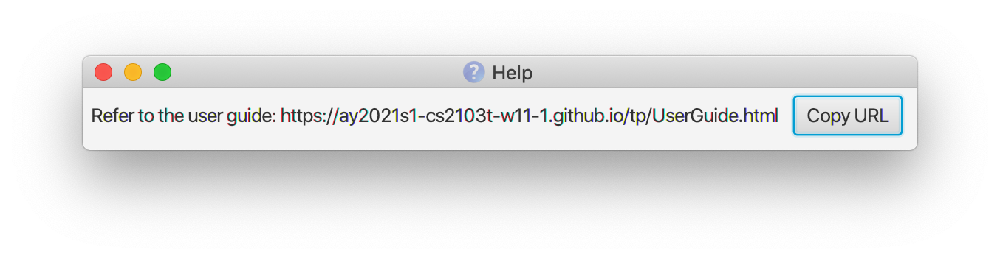

Format: `help`

#### 2.1.2 Exiting the program : `exit`

To exit Archangel, simply enter `exit`, Archangel will close.

Format: `exit`

#### 2.1.3 Saving the data

The Archangel data is saved in the hard disk automatically after any command that changes the data. There is no need to save manually.

### 2.2 Patient Features

#### 2.2.1 Adding a patient: `p-add`

Adds a patient to Archangel.

"A new patient has contacted me and wants to make an appointment. First, I have to add him along with his details to Archangel!" One of the most fundamental use of Archangel; to store patient data, can be done through the command `p-add`.

Format: `p-add n/NAME g/GENDER bd/BIRTHDATE bt/BLOODTYPE p/PHONE_NUMBER e/EMAIL a/ADDRESS [t/TAG]…`​

Examples:
* `p-add n/John Doe g/MALE bd/2018-12-27 bt/A+ p/98765432 e/johnd@example.com a/311, Clementi Ave 2, #02-25` adds a Patient with the mentioned information into Archangel.

**:information_source: Things to Note:** 

* Compulsory fields include NAME, GENDER, BIRTHDATE, BLOODTYPE, PHONE_NUMBER, EMAIL and ADDRESS  
* TAGS are not compulsory  
* BIRTHDATE should be in YYYY-MM-DD format.  
* BLOODTYPE can be only one of the following per patient: `A+`, `A-`, `B+`, `B-`, `O`, `O+`, `O-`, `AB+`, `AB-`  
* At initial launch of Archangel, there is a pre-loaded sample list of Patients.  

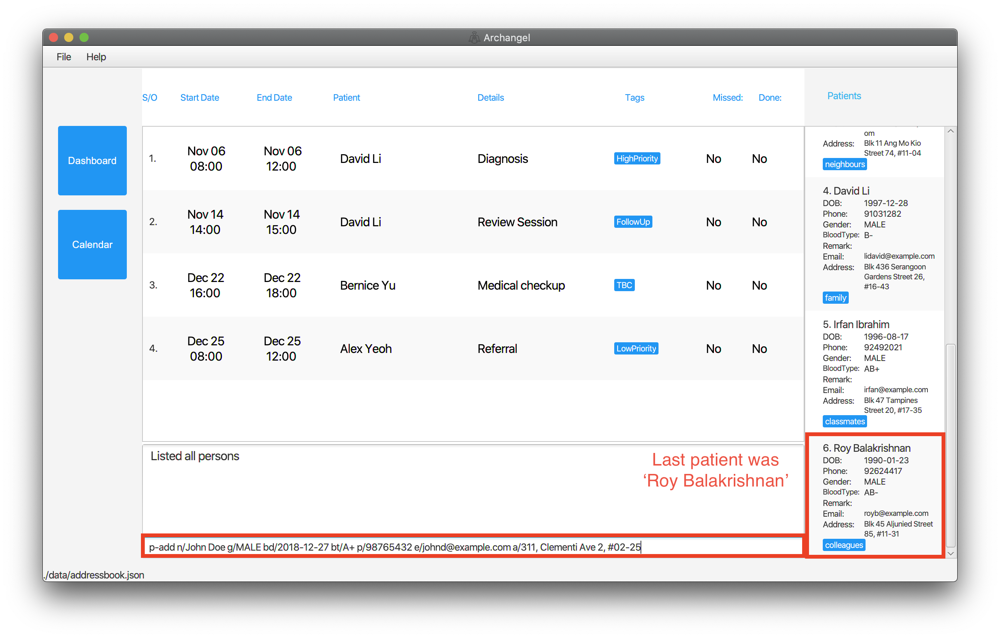  
Figure 2.2.1.1: <i>Before `p-add n/John Doe g/MALE bd/2018-12-27 bt/A+ p/98765432 e/johnd@example.com a/311, Clementi Ave 2, #02-25`.</i>
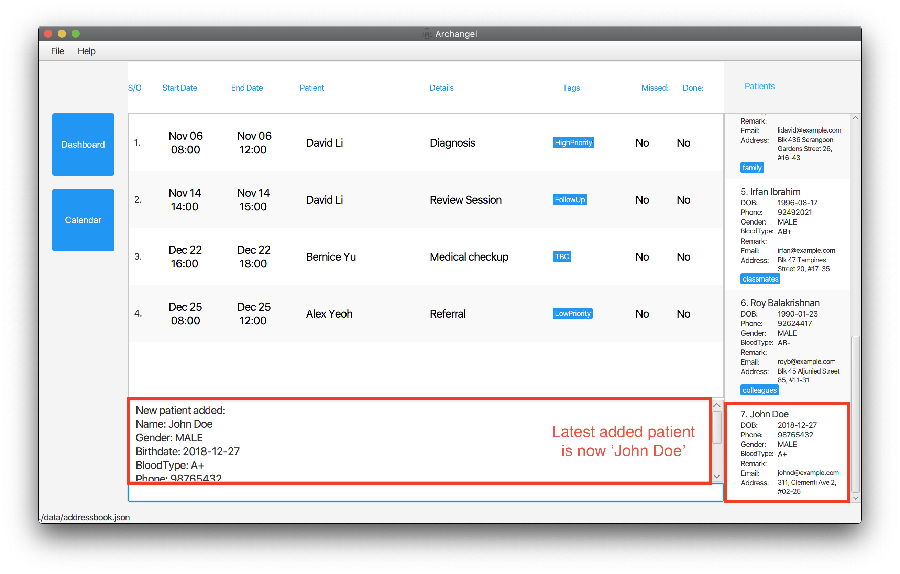  
Figure 2.2.1.2: <i>After `p-add n/John Doe g/MALE bd/2018-12-27 bt/A+ p/98765432 e/johnd@example.com a/311, Clementi Ave 2, #02-25`.</i>

:bulb: Tip:
A patient can have any number of tags (including 0)

Examples:
* `p-add n/John Doe g/MALE bd/2018-12-27 bt/A+ p/98765432 e/johnd@example.com a/311, Clementi Ave 2, #02-25 t/friends t/owesMoney`
* `p-add n/Betsy Crower t/friend g/FEMALE bd/2000-12-27 bt/A+ e/betsycrower@example.com a/Newgate Prison p/1234567 t/criminal`

#### 2.2.2 Listing all patients : `p-list`

"I want to see all of my patients in one list!" You can do so with the command `p-list`.

Format: `p-list`

Examples:
* `p-find alex` followed by `p-list` changes the patient list under view from patients with `alex` in their names to the All-Patients list

**:information_source: Things to Note:** 

* This is the default for Archangel, whenever Archangel is started, the patient list on the right is what you will see on `p-list`.  
* Typical use case for this command is to change the current patient list that is being viewed back to the All-Patients list.  

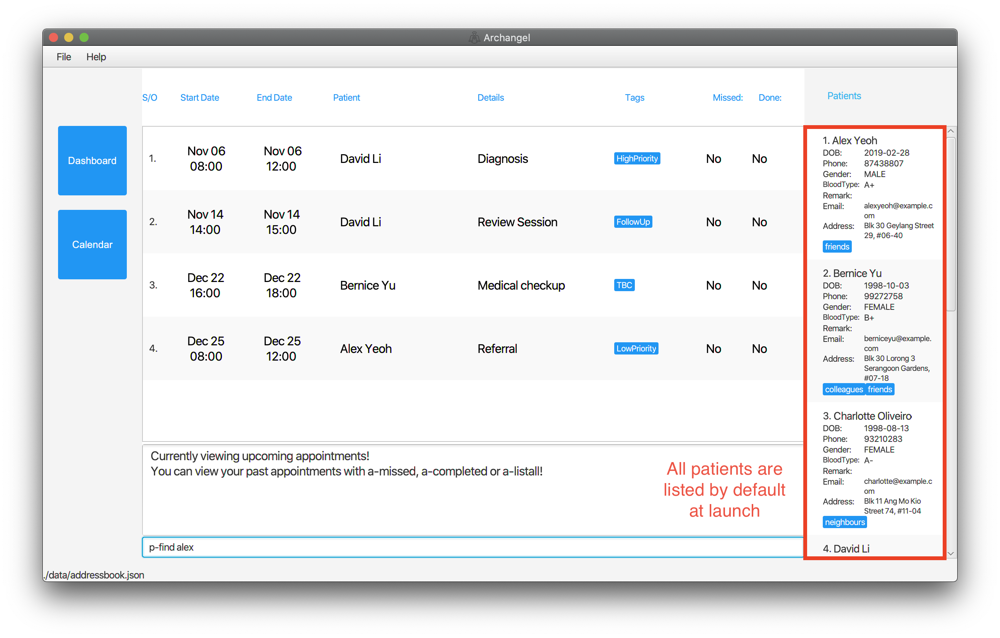  
Figure 2.2.2.1: <i>Initial state of Archangel at launch. 
(All-Patient list is the list under view!)</i>
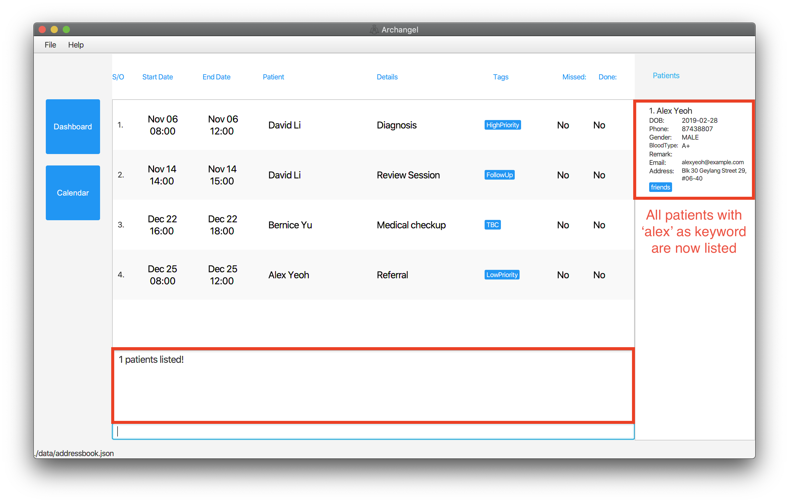  
Figure 2.2.2.2: <i>After `p-find alex`. 
(All-Patients list changed to list of patients with 'alex' in their name!)</i>
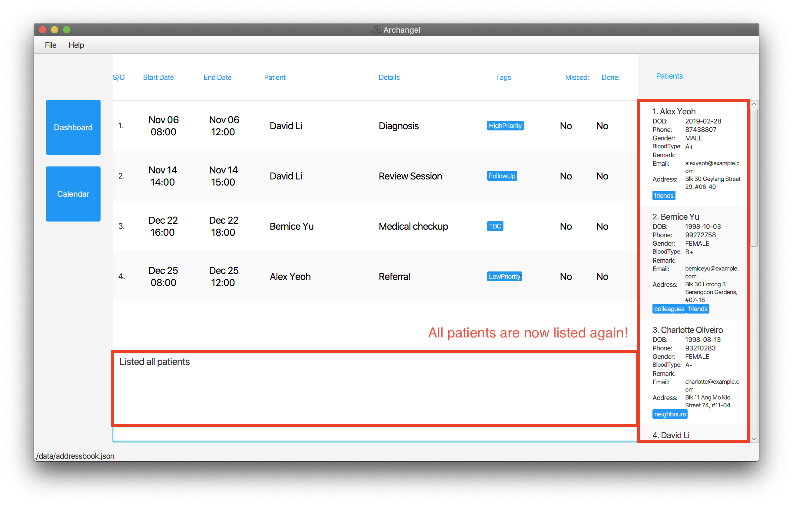  
Figure 2.2.2.3: <i>After `p-list` 
(All-Patient list is back as the list under view!).</i>

#### 2.2.3 Editing a patient : `p-edit`

"Oh no, I keyed in one of my patient's information incorrectly!" Do not worry, as you can change your patients' particulars with the command `p-edit`.

Format: `p-edit INDEX [n/NAME] [g/GENDER] [bd/BIRTHDATE] [bt/BLOODTYPE] [p/PHONE] [e/EMAIL] [a/ADDRESS] [t/TAG]…​`

Examples:
* `p-edit 1 p/91234567 e/johndoe@example.com` Edits the phone number and email address of the 1st patient to be `91234567` and `johndoe@example.com` respectively.
* `p-edit 2 n/Betsy Crower t/` Edits the name of the 2nd patient to be `Betsy Crower` and clears all existing tags.

**:information_source: Things to Note:** 

* Edits the patient at the specified INDEX. The index refers to the index number shown in the displayed patient list. The index must be a positive integer 1, 2, 3, …​  
* At least one of the optional fields must be provided.  
* Existing values will be updated to the input values.  
* When editing tags, the existing tags of the patient will be removed i.e adding of tags is not cumulative.  
* You can remove all the patient’s tags by typing `t/` without specifying any tags after it.  
* For editing of remarks, please look at the commands specifically related to remarks.  
* Note: Editing a patient will also update the patient in Appointments that contain the patient.  

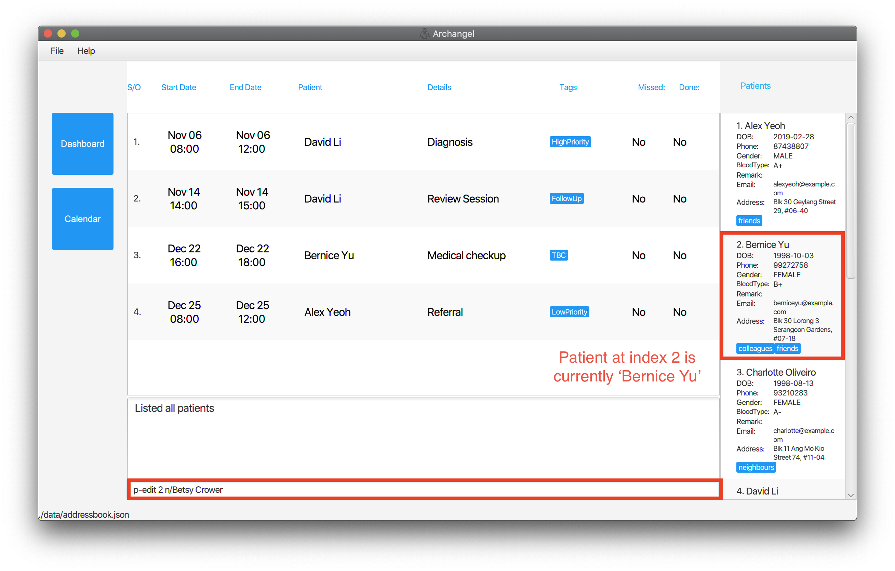  
Figure 2.2.3.1: <i>Initial state of Archangel at launch. 
(All-Patient list is the list under view!)</i>
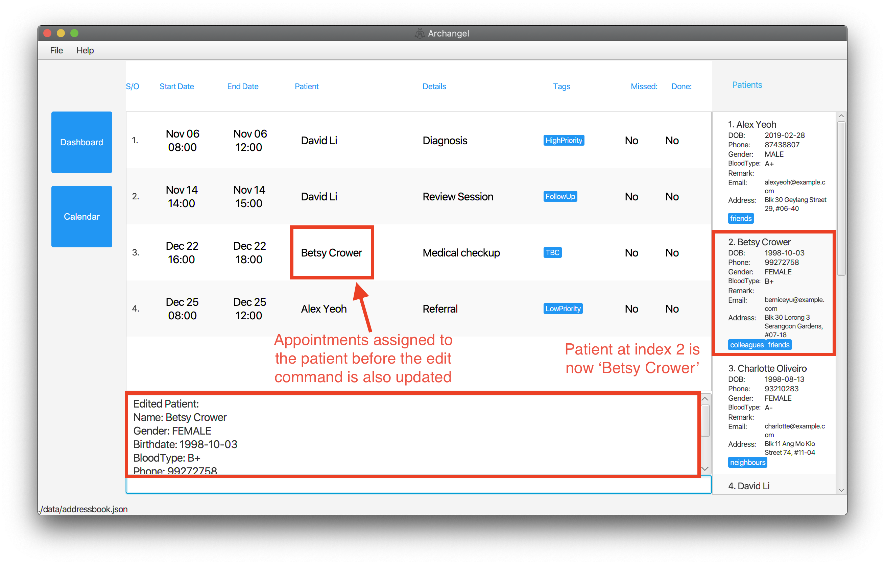  
Figure 2.2.3.2: <i>After `p-edit 2 n/Betsy Crower`. 
(Patient at index 2 on the patient list has their name changed to Betsy Crower! Affected appointments also have their patient updated!).</i>

#### 2.2.4 Locating patients by name: `p-find`

"I want to find all patients with 'Yeoh' in their names!" You can find all of these patients with the command `p-find Yeoh` or `p-find yeoh`.

Format: `p-find KEYWORD [MORE_KEYWORDS]`

Examples:
* `p-find John` returns `John Chew` and `John Doe`
* `p-find alex david` returns `Alex Yeoh`, `David Li` 

**:information_source: Things to Note:** 

* The search is case-insensitive. e.g `hans` will match `Hans`  
* The order of the keywords does not matter. e.g. `Hans Bo` will match `Bo Hans`  
* Only the name will be searched.  
* Only full words will be matched e.g. `Han` will not match `Hans`  
* Persons matching at least one keyword will be returned (i.e. OR search).  
  e.g. `Hans Bo` will return `Hans Gruber`, `Bo Yang`

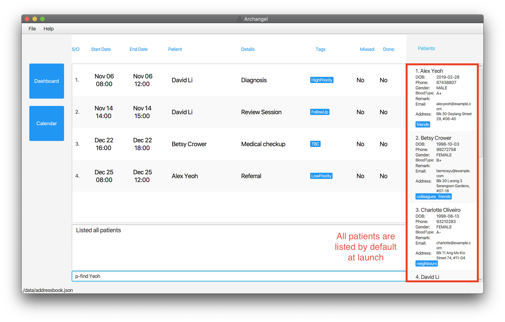  
Figure 2.2.4.1: <i>Initial state of Archangel at launch. 
(All-Patient list is the list under view!)</i>
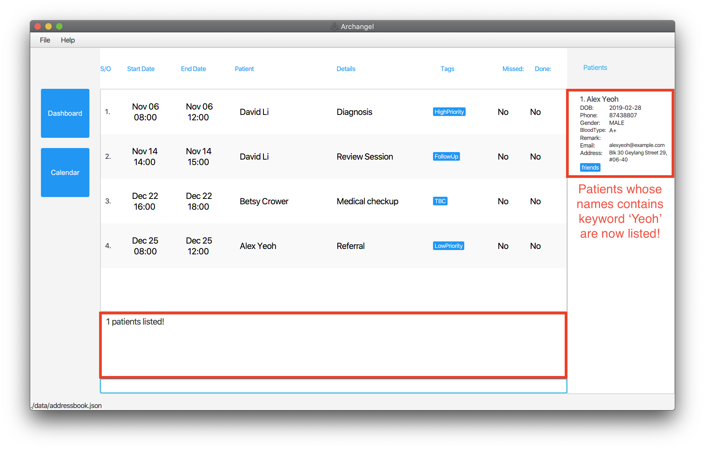  
Figure 2.2.4.2: <i>After `p-find Yeoh`. 
(All patients with 'Yeoh' in their names will be displayed!)</i>

#### 2.2.5 Giving a patient a Remark : `p-remark`

"One of my patients has allergies. I want to be able to store this information." You can store special information as a remark using the command `p-remark`.

Format: `p-remark INDEX r/REMARK`

Examples:
* `p-remark 1 r/Allergic to nuts` gives the 1st patient in the list a remark of `Allergic to nuts`

**:information_source: Things to Note:** 

* Store a remark for the patient at the specified INDEX.  
* The index refers to the index number shown in the displayed patient list.  
* The index must be a positive integer 1, 2, 3, …​  

  
Figure 2.2.5.1: <i>Before `p-remark 1 r/Allergic to nuts`. 
(Patient Alex Yeoh has no remarks.)</i>
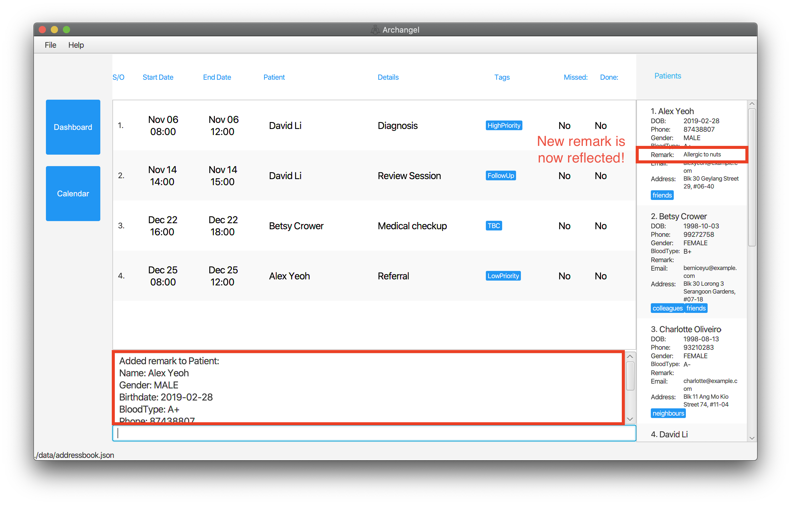  
Figure 2.2.5.2: <i>After `p-remark 1 r/Allergic to nuts`. 
(Patient Alex Yeoh now has a remark that says "Allergic to nuts".)</i>

#### 2.2.6 Removing a patient's Remark : `p-remark`

"The remark for the patient no longer applies, I want to remove it from the patient." You can remove remarks using the command `p-remark`.

Format: `p-remark INDEX`

Examples:
* `p-remark 1` removes the Remark of the 1st patient on the list.

**:information_source: Things to Note:** 

* Removes all your remarks for the patient at the specified INDEX.  
* The index refers to the index number shown in the displayed patient list.  
* The index must be a positive integer 1, 2, 3, …​  

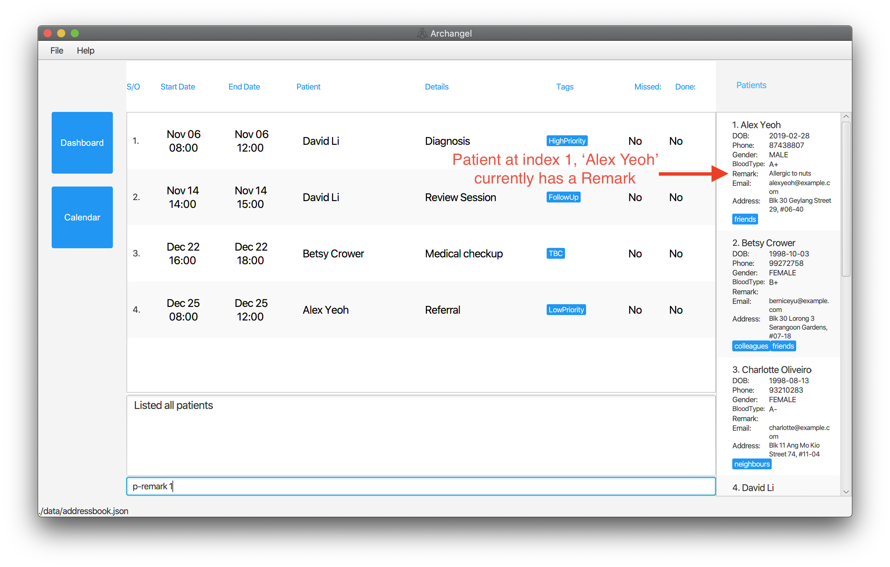  
Figure 2.2.6.1: <i>Before `p-remark 1`. 
(Patient Alex Yeoh has a remark that says "Allergic to nuts".)</i>
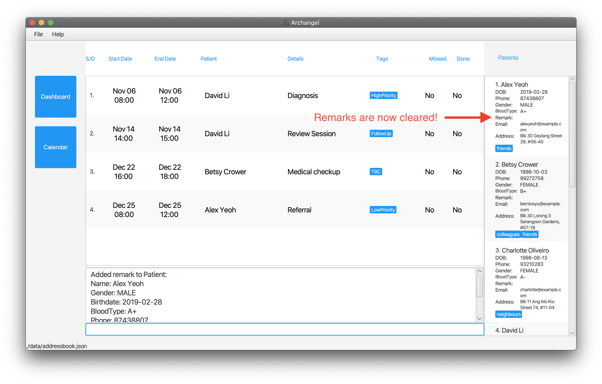  
Figure 2.2.6.2: <i>After `p-remark 1`. 
(Patient Alex Yeoh no longer has a remark!)</i>

#### 2.2.7 Deleting a patient : `p-delete`

"One of my patients will no longer be visiting. I want to be remove him from Archangel so it looks less cluttered." You can remove patients from Archangel using the command `p-delete`.

Format: `p-delete INDEX`

Examples:
* `p-delete 1` deletes the 1st patient in Archangel and also deletes all of his/her appointments.

**:information_source: Things to Note:** 

* Deletes the patient at the specified INDEX.  
* The index refers to the index number shown in the displayed patient list.  
* The index must be a positive integer 1, 2, 3, …​  
* Note: Deleting a patient will also delete all Appointments that contains the deleted patient.  

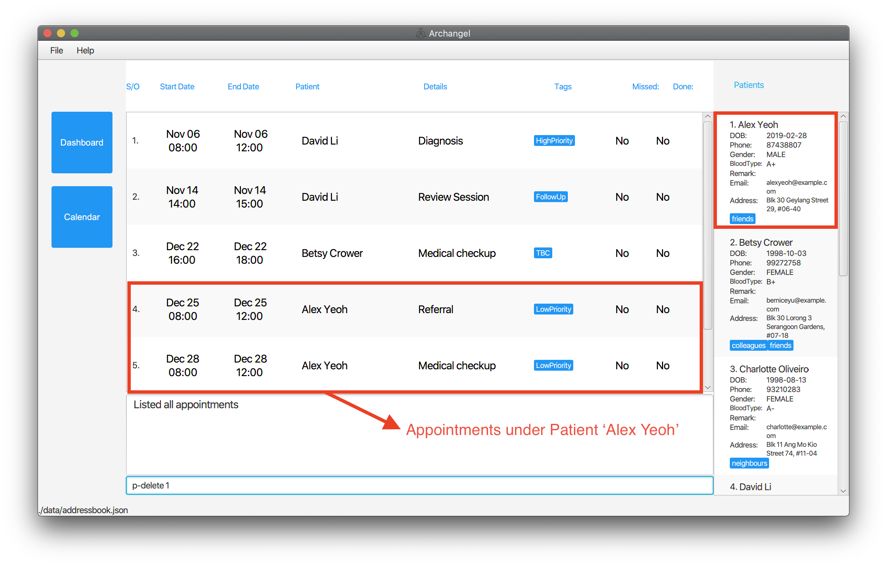  
Figure 2.2.7.1: <i>Before `p-delete 1`. 
(Patient Alex Yeoh is in the patient list, and the appointment list shows an appointment under Alex Yeoh.)</i>
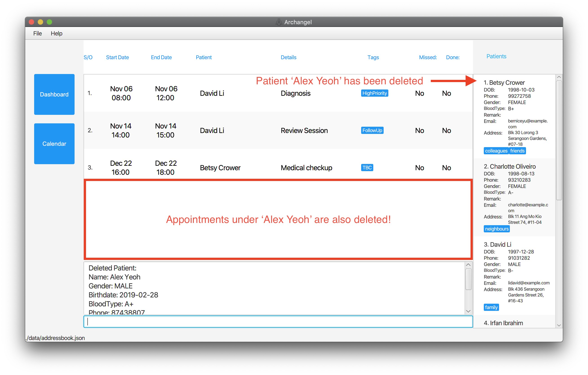  
Figure 2.2.7.2: <i>After `p-delete 1`. 
(Patient Alex Yeoh is no longer on the patient list, every appointment under Alex Yeoh is also removed from the All-Appointments list!)</i>

### 2.3 Appointment Features

#### 2.3.1 Scheduling an appointment : `a-schedule`

Now that you have patients, it is time to schedule your first appointment! Scheduling an appointment can be done using the command `a-schedule`.

Format: `a-schedule pt/INDEX start/DATE&TIME end/DATE&TIME d/DESCRIPTION [t/TAGS]…`

Examples:
* `a-schedule pt/2 start/2020-12-14 08:00 end/2020-12-14 10:00 d/Review Appointment` schedules an appointment for patient at index `2` on `2020-12-14` from `08:00` to `10:00` with appointment description `Review Appointment`.

**:information_source: Things to Note:** 

* Backdated appointments are allowed for clinics to be able to digitise their existing appointment records. 
* Schedules patient appointment for patient at INDEX in the displayed patient list. 
* Appointment will be set to input DATE (format: YYYY-MM-DD) and TIME (format: HH:MM). 
* Appointment time must be indicated as HH:MM (i.e. 9AM must be `09:00`, and not `9:00`). 
* Appointment time (i.e. duration from `start` to `end`) cannot overlap with another existing appointment. 
* Appointment duration should not exceed 24 hours. 
* TAGS should be alphanumeric. 

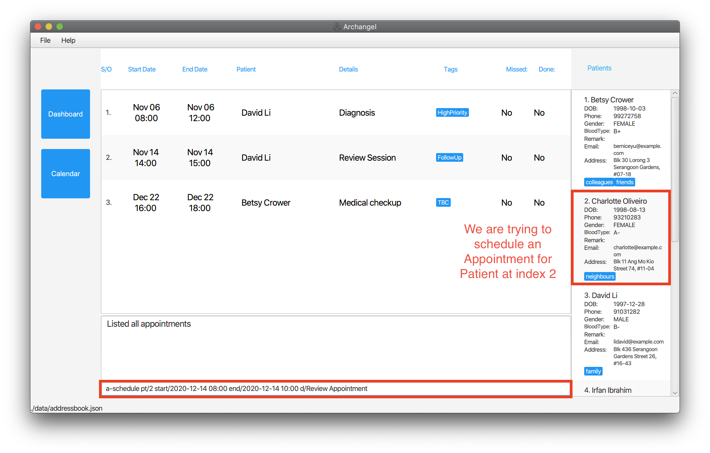  
Figure 2.3.1.1: <i>Before `a-schedule pt/2 start/2020-12-14 08:00 end/2020-12-14 10:00 d/Review Appointment`.</i>
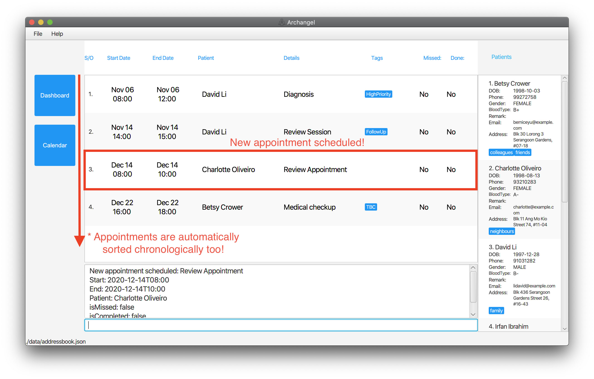  
Figure 2.3.1.2: <i>After `a-schedule pt/2 start/2020-12-14 08:00 end/2020-12-14 10:00 d/Review Appointment`.  
(New scheduled appointment has been added to the list!).</i>

#### 2.3.2 Deleting an appointment : `a-delete`

Oh no! Your patient just called to cancel his appointment! Since we will not need the appointment anymore, let's delete the appointment using the command `a-delete`.

Format: `a-delete INDEX`

Examples:
* `a-list` followed by `a-delete 2` deletes the 2nd appointment in the Archangel.
* `a-find Review` followed by `a-delete 1` deletes the 1st appointment in the results of the find command.

**:information_source: Things to Note:** 

* Deletes the appointment at the specified INDEX. 
* The index refers to the index number shown in the displayed appointment list. 
* The index must be a positive integer 1, 2, 3, …​ 

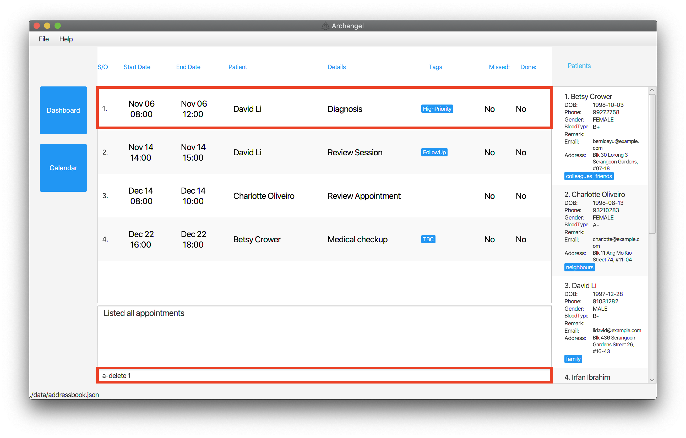  
Figure 2.3.2.1: <i>Before `a-delete 1`.</i>
  
Figure 2.3.2.2: <i>After `a-delete 1'. 
(Appointment previously at index 1 is now gone!).</i>

#### 2.3.3 Editing an appointment : `a-edit`

What if your patients decides to change his appointment details? Archangel allows you to edit existing patient appointments using the command `a-edit`.

Format: `a-edit INDEX [start/DATE&TIME] [end/DATE&TIME] [pt/PATIENT INDEX] [d/DESCRIPTION] [t/TAGS]…`

Examples:
* `a-edit 1 start/2020-11-15 12:00 end/2020-11-15 14:00 pt/2` Edits the start and end date & time of the 1st appointment to be `2020-11-15` at `12:00` and `2020-11-15` at `14:00` respectively, and edits patient to 2nd patient in patient list.

**:information_source: Things to Note:** 

* Backdated appointments are allowed to be able to digitise existing appointment records .  
* Edits the appointment at the specified INDEX. The index refers to the index number shown in the displayed appointment list. The index must be a positive integer 1, 2, 3, …​  
* At least one of the optional fields must be provided. 
* Existing values will be updated to the input values. 
* When editing tags, the existing tags of the appointment will be removed i.e adding of tags is not cumulative. 
* You can remove all the appointment’s tags by typing `t/` without specifying any tags after it. 
* Tags must be alphanumeric and individual tags cannot be separated by spaces (i.e. `HighPriority` is a valid input, while `High Priority` is an invalid input). 
* Editing an appointment's time may cause it's missed status to change as well. 

  
Figure 2.3.3.1: <i>Before `a-edit 1 start/2020-11-15 12:00 end/2020-11-15 14:00 pt/2`.</i>
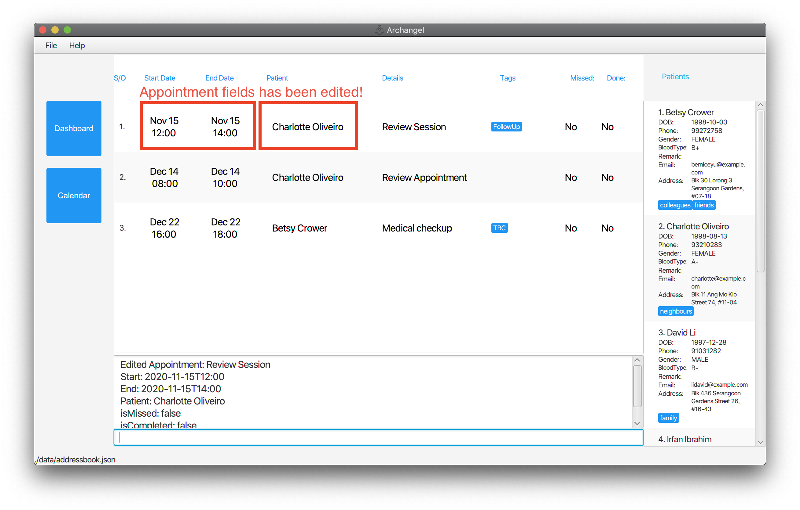  
Figure 2.3.3.2: <i>After `a-edit 1 start/2020-11-15 12:00 end/2020-11-15 14:00 pt/2`. 
(Appointment time and patient has been updated!).</i>

#### 2.3.4 Setting appointment as completed : `a-complete`

You have just finished an appointment. Instead of deleting it, let's set it as completed with the command `a-complete`. This way you can still find it using specific commands.

Format: `a-complete INDEX`

Examples:
* `a-complete 1` Sets the appointment at index 1 as completed.

**:information_source: Things to Note:** 

* Edits the appointment at the specified INDEX. 
* The index refers to the index number shown in the displayed appointment list. 
* The index must be a positive integer 1, 2, 3, …​ 

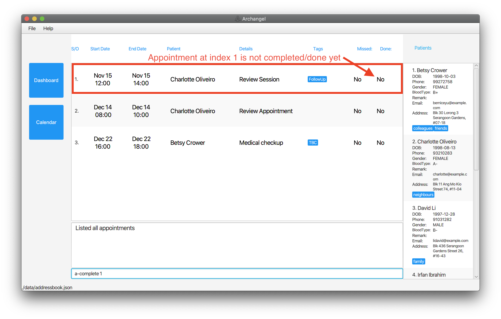  
Figure 2.3.4.1: <i>Before `a-complete 1`.</i>
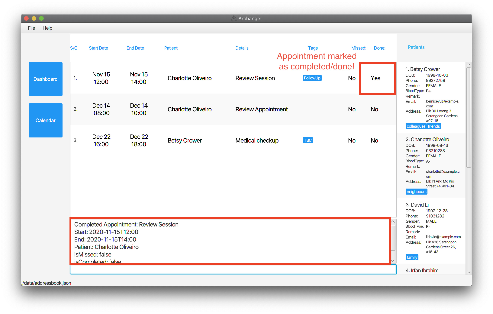  
Figure 2.3.4.2: <i>After `a-complete 1`. 
(Appointment at index 1 is now labelled as Done).</i>

#### 2.3.5 Setting appointment as missed :

Did your patient not show up? Archangel helps you keep track of missed appointments!

Appointments are automatically set as missed if they satisfy both criteria:
* Appointment end time has passed by at least 30 minutes.
* Appointment has not been set as completed.

#### 2.3.6 Listing all past and present appointments : `a-listall`

You can also view a combined list of all appointments including missed, completed and upcoming patient appointments using the command `a-listall`.

Format: `a-listall`

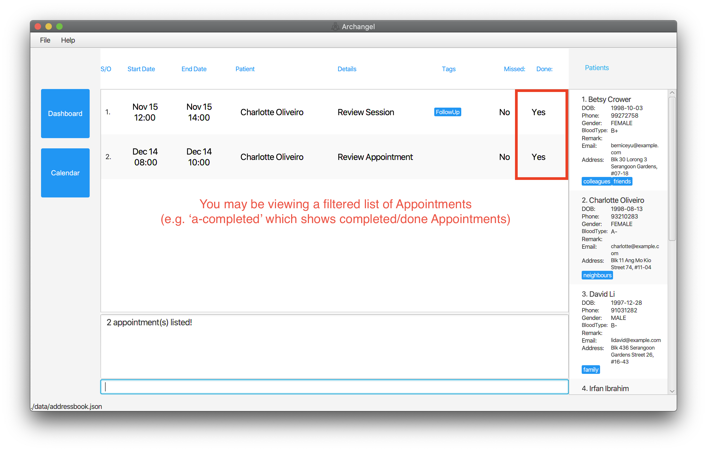  
Figure 2.3.6.1: <i>Before `a-listall`.</i>
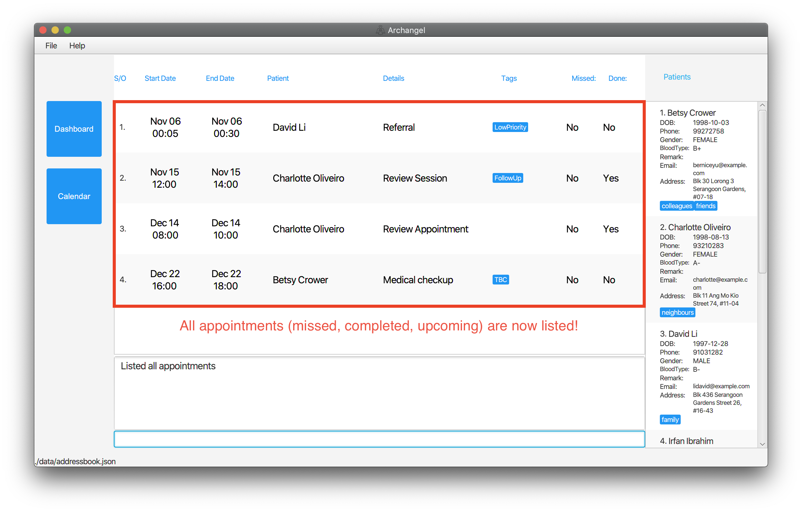  
Figure 2.3.6.2: <i>After `a-listall`. 
(Appointment list now displays all missed, completed and upcoming appointments!).</i>

#### 2.3.7 Filtering appointment list

If you are looking for a specific appointment, Archangel allows you to filter your appointment list in various ways.

##### 2.3.7.1 Listing all upcoming appointments : `a-list`

Shows a list of all your uncompleted upcoming patient appointments in Archangel.

Format: `a-list`

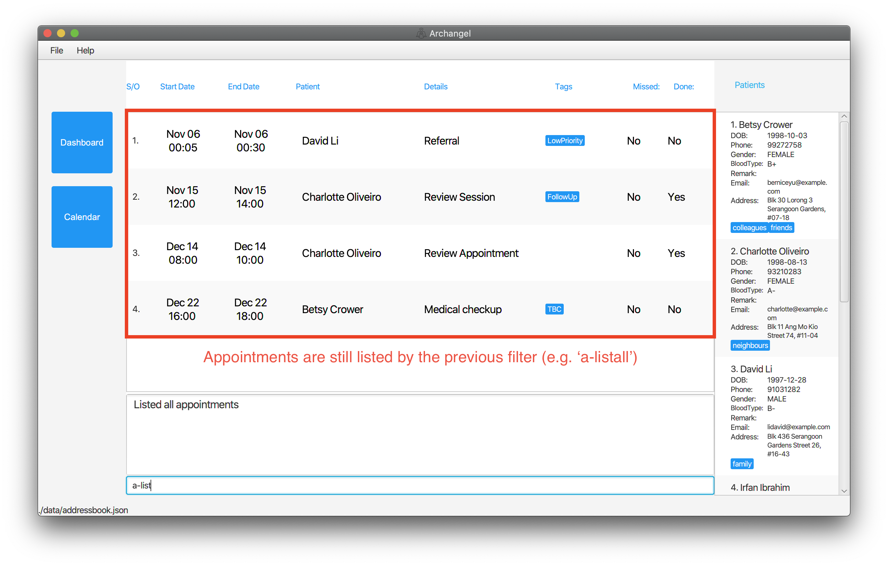  
Figure 2.3.7.1.1: <i>Before `a-list`.</i>
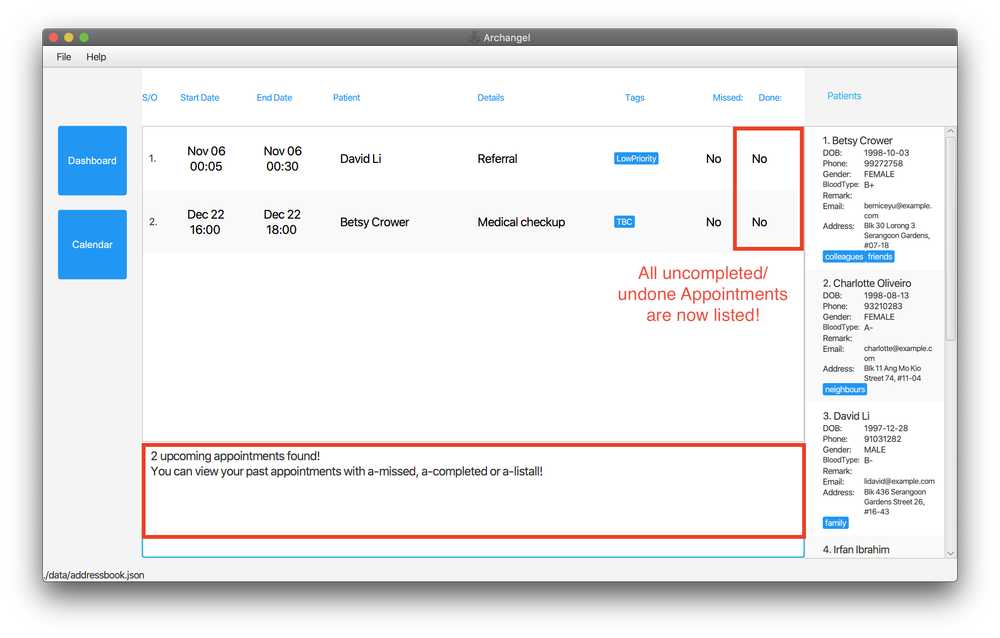  
Figure 2.4.1.2: <i>After `a-list`. 
(Appointment list now displays only upcoming appointments!).</i>

##### 2.3.7.2 Finding appointments by patient name : `a-find`

Archangel finds your appointments with patients whose name contains the given keywords.

Format: `a-find KEYWORD [MORE_KEYWORDS]`

Examples:
* `a-find Charlotte` returns Appointment with Patient name of `Charlotte Oliveiro`
* `a-find Jack Jill` returns Appointments with Patient name of `Jack Sparrow` and `Jill Ous`

**:information_source: Things to Note:** 

* The search is case-insensitive. e.g `charlotte` will match `Charlotte`  
* The order of the keywords does not matter. e.g. `Jack Jill` will match `Jill Jack`  
* Only the patient name inside the appointment is searched.  
* Only full words will be matched e.g. `Charlotte` will not match `Charlotttee`  
* Appointments matching at least one keyword will be returned (i.e. OR search).  
  e.g. `Jack Jill` will return Appointments with Patient name of `Jack Sparrow`, `Jill Ous`

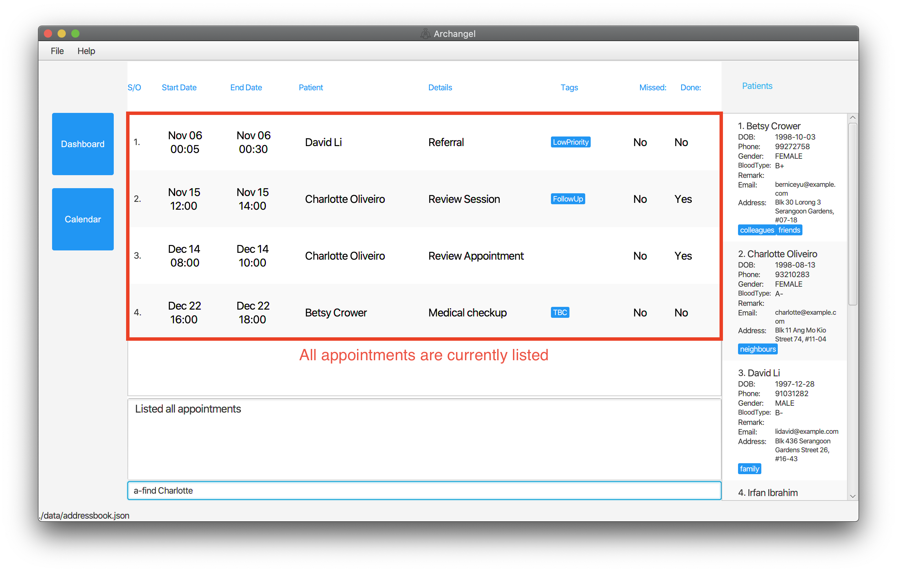  
Figure 2.3.7.2.1: <i>Before `a-find Charlotte`.</i>
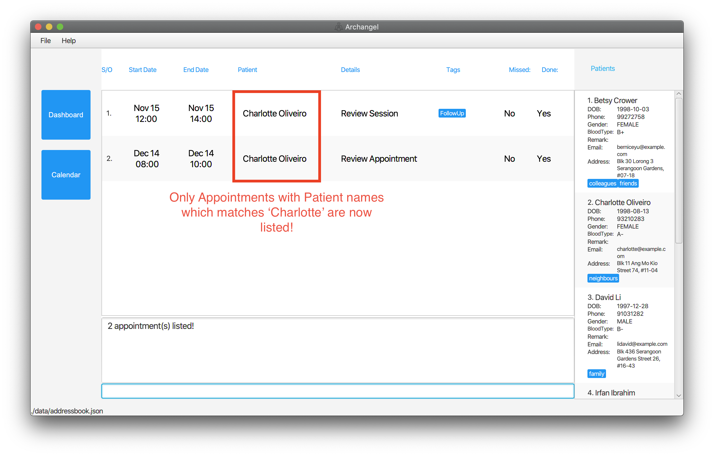  
Figure 2.3.7.2.2: <i>After `a-find Charlotte`. 
(Appointment list now displays only appointments with patient names that match with "Charlotte"!).</i>

##### 2.3.7.3 Finding appointments by tags: `a-tag`

Archangel finds your appointments which are tagged by any of the given keywords.

Format: `a-tag KEYWORD [MORE_KEYWORDS]`

Examples:
* `a-tag LowPriority` returns Appointments tagged `LowPriority`
* `a-tag friend enemy`  returns Appointments tagged `Friend` and `Enemy` or both

**:information_source: Things to Note:** 

* The search is case-insensitive. e.g `friends` will match `Friends`  
* The order of the keywords does not matter. e.g. `friends enemy` will match `Friends Enemy`  
* Only the tags inside the appointment will be searched.  
* Only full words will be matched e.g. `Friend` will not match `Friends`  
* Appointments matching at least one keyword will be returned (i.e. OR search).  
  e.g. `friends enemy` will return Appointment tagged with `Friends`, `Enemy`

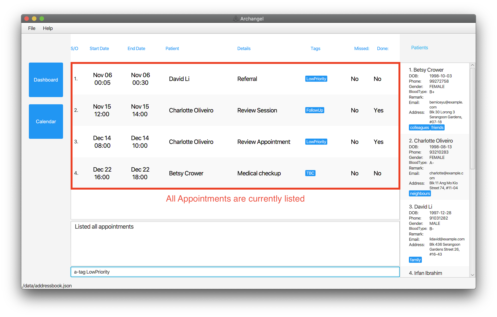  
Figure 2.3.7.3.1: <i>Before `a-tag`.</i>
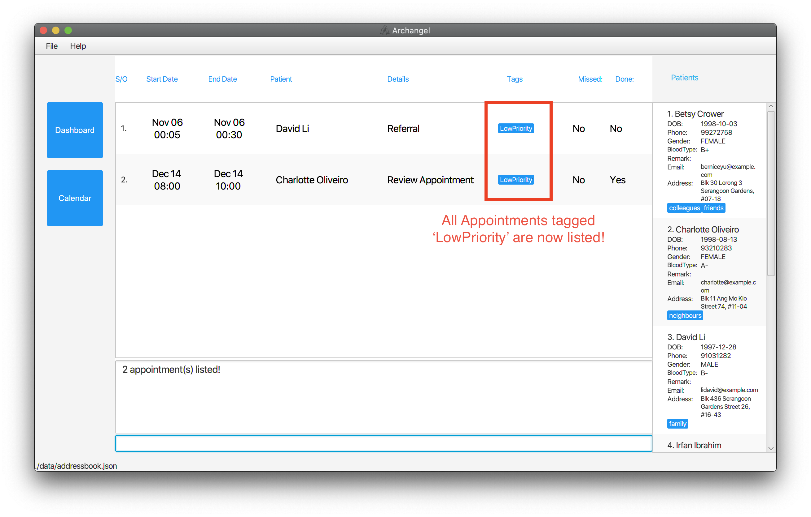  
Figure 2.3.7.3.2: <i>After `a-tag`. 
(Appointment list now displays only appointments with the tag "LowPriority"!).</i>

##### 2.3.7.4 Finding an appointment by current date: `a-today`

Finds your uncompleted appointments scheduled on the current date.

Format: `a-today`

Examples:
* `a-today` returns Appointments scheduled today.

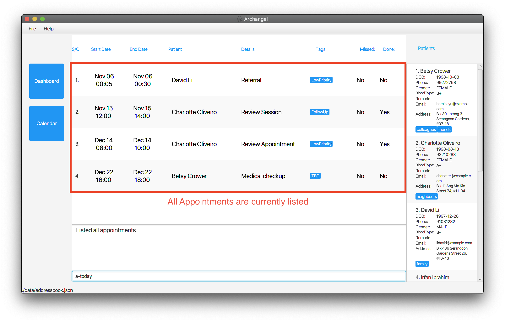  
Figure 2.3.7.4.1: <i>Before `a-today`.</i>
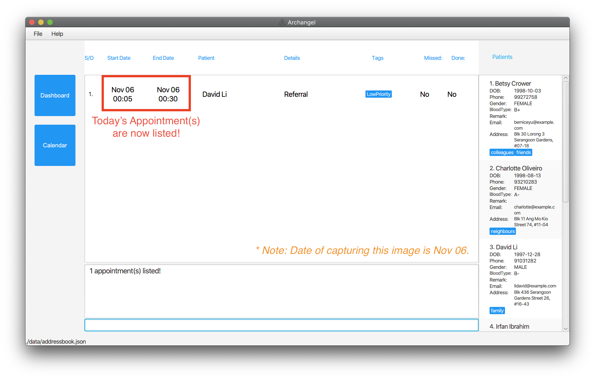  
Figure 2.3.7.4.2: <i>After `a-today`. 
(Appointment list now displays only upcoming appointments that are today!).</i>

##### 2.3.7.5 Finding an appointment by current week: `a-upcoming`

Finds your uncompleted appointments scheduled in the current week.

Format: `a-upcoming`

Examples:
* `a-upcoming` returns uncompleted Appointments scheduled this week (from this week's Sunday to Saturday).

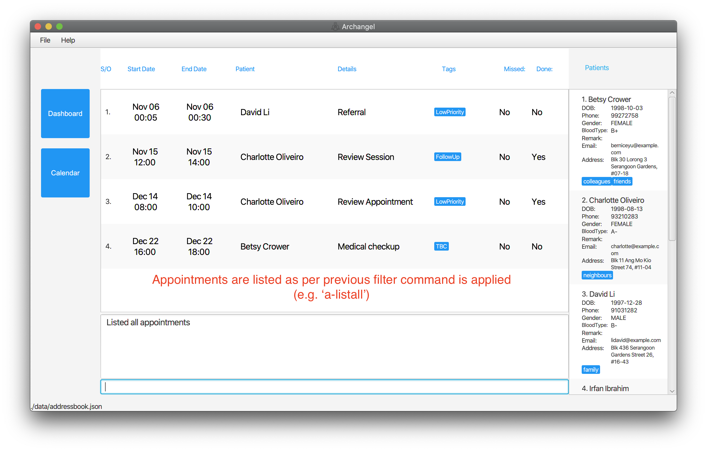  
Figure 2.3.7.5.1: <i>Before `a-upcoming`.</i>
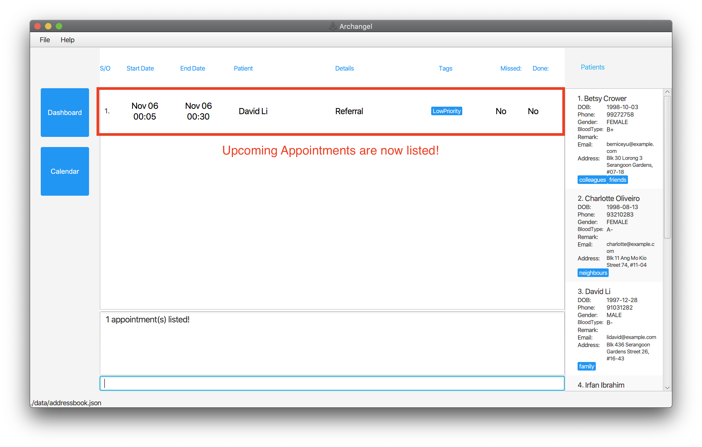  
Figure 2.3.7.5.2: <i>After `a-upcoming`. 
(Appointment list now displays only upcoming appointments that are this week!).</i>

##### 2.3.7.6 Listing appointments that are completed: `a-completed`

Shows a list of all your appointments that have been completed.

Format: `a-completed`

Examples:
* `a-completed` returns all completed Appointments.

  
Figure 2.3.7.6.1: <i>Before `a-completed`.</i>
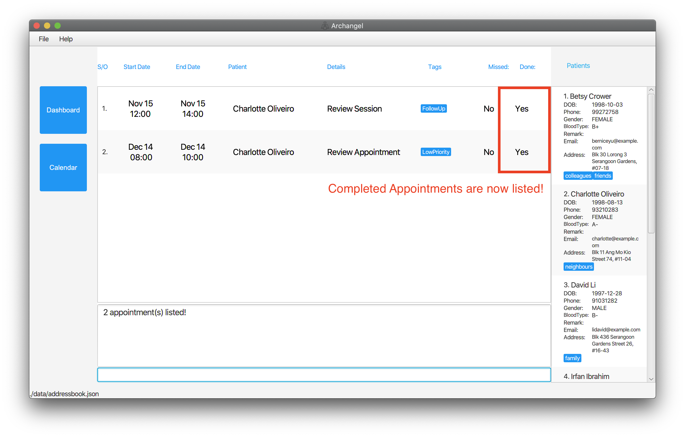  
Figure 2.3.7.6.2: <i>After `a-completed`. 
(Appointment list now displays only completed appointments!).</i>

##### 2.3.7.7 Listing appointments that are missed: `a-missed`

Shows a list of all your appointments that have been missed.

Format: `a-missed`

Examples:
* `a-missed` returns all missed Appointments.

  
Figure 2.3.7.7.2: <i>Before `a-missed`.</i>
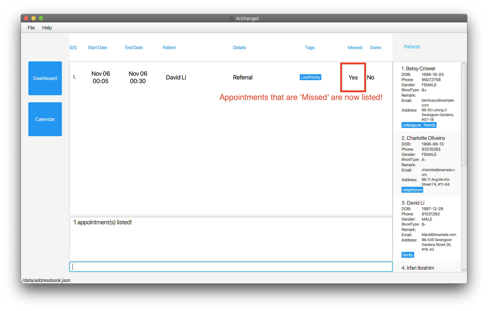  
Figure 2.3.7.7.2: <i>After `a-missed`. 
(Appointment list now displays only missed appointments!).</i>

### 2.4 Supporting Commands

#### 2.4.1 Undoing the previous command : `undo`
"Oops, I accidentally deleted the wrong appointment!", fret not! You can undo your commands through the command `undo`.

Format: `undo`

Examples:
* `p-delete 1` followed by `undo` undoes the edit command and make no changes to Archangel.

**:information_source: Things to Note:** 

* This command has no keywords. 
* This command does not work with filter commands (`a-completed`,`a-missed`,`a-upcoming`,`a-today`,`a-find`,`a-list`)  
  as its implementation purpose is to assist the user in undo-ing his changes, filter commands do not make changes to the data. 
  It also does not work with `p-edit` as the design requires patient details to be accurate as of time schedule, such that the
  records can accurately reflect the patient's conditions at the time of the appointment.  
* A list of commands that can be undone can be found in the table under Command Summary.  
* This command can be succeeded by a `redo` command.

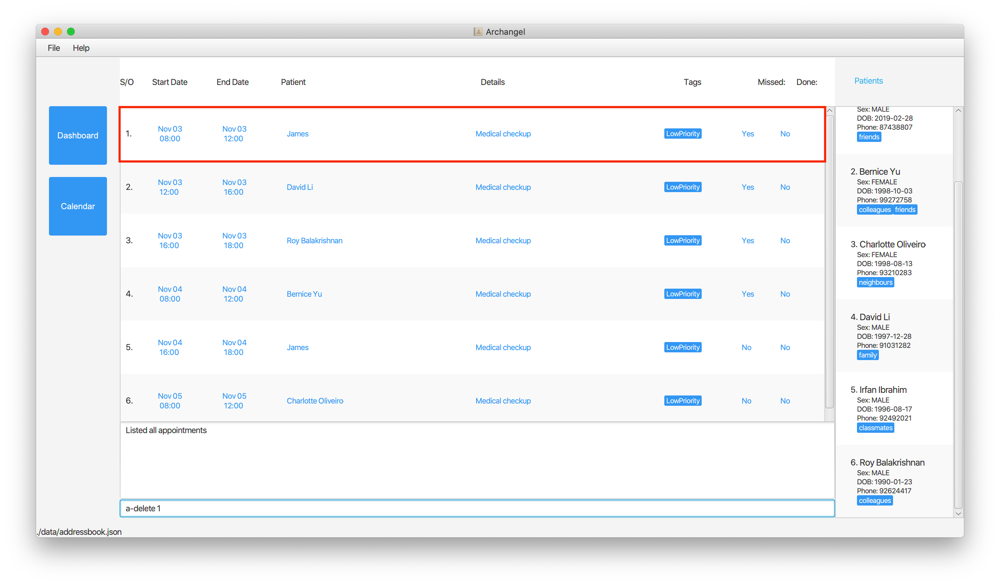  
Figure 2.4.1.1: <i>Before `a-delete 1`.</i>
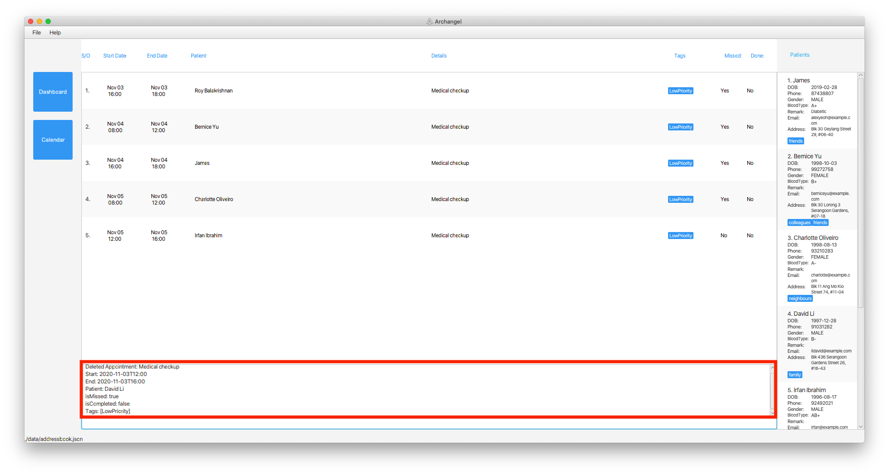  
Figure 2.4.1.2: <i>After `a-delete 1`. (Roy is gone!)</i>
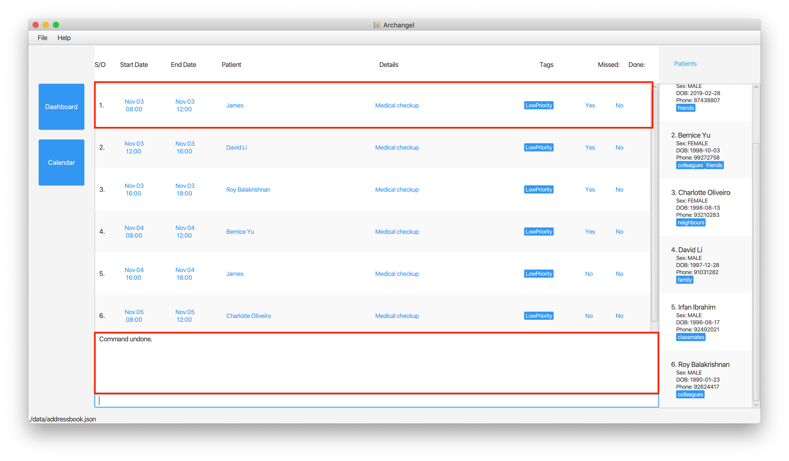  
Figure 2.4.1.3: <i>After `undo`. (Roy is back!)</i>

#### 2.4.2 Redoing the previous command : `redo`
When there is an `undo`, there is always a `redo`! You can always `redo` commands that you `undo` previously!

Format: `redo`

Examples:
* `p-delete 1` followed by `undo` then `redo` redoes the `undo` command and carries out the delete command.

**:information_source: Things to Note:** 

* This command has no keywords.  
* This command must be preceded by `undo`.

  
Figure 2.4.2.1: <i>After `a-delete 1` (Roy is gone!).</i>
  
Figure 2.4.2.2: <i>After `undo` (Roy is back!).</i>
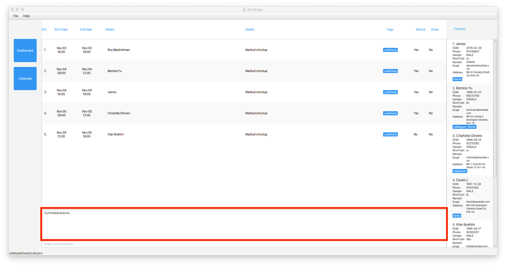  
Figure 2.4.2.3: <i>After `redo` (Roy is gone!).</i>

### 2.5 Miscellaneous Features

#### 2.5.1 Suggestion Box

Find it troublesome to keep referring to the User Guide for the format of commands? You can always refer to the suggestion box which is shown once you enter your commands. 
As you type letter by letter, the suggestion box will automatically match your input to the most similar command, allowing you to refer to it on the go!

  
Figure 2.5.1: <i>The suggestion box provides the format as you insert a `p-add` command.</i>

#### 2.5.2 In-built Calendar feature
You can refer to the in-built calendar feature to view all the appointments within the week at a glance.

  
Figure 2.5.2.1: <i>Click on the calendar button.</i>
  
Figure 2.5.2.2: <i>The calendar panel will be shown with all the appointments in the week listed.</i>

--------------------------------------------------------------------------------------------------------------------

## FAQ

**Q:** How do I transfer my data to another Computer? 
**A:** A data folder will be created in the same directory that you run Archangel.jar. This data folder will contain your existing data. Simply copy this data folder into the other Computer, ensure that the data folder is in the same directory as Archangel.jar, and simply run Archangel.

Pictorial guide for Windows:

  
   <i>Figure above shows the initial folder that Archangel is in before starting.</i>
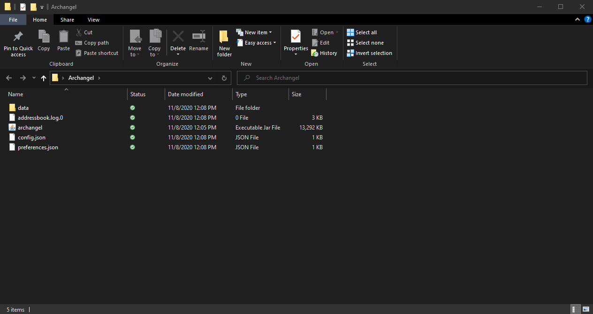  
   <i>Figure above shows the additional files including the data file after the user uses Archangel.</i>

Pictorial guide for Mac:

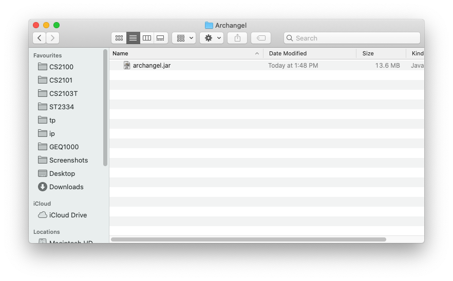  
   <i>Figure above shows the initial folder that Archangel is in before starting.</i>
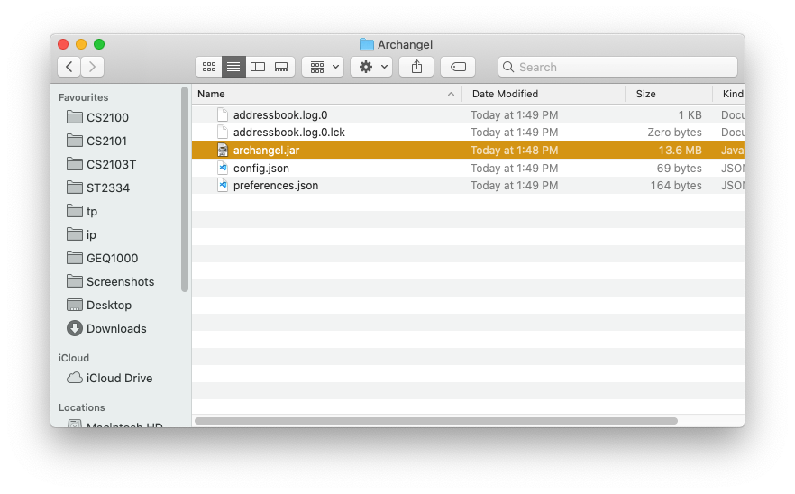  
   <i>Figure above shows the additional files including the data file after the user uses Archangel.</i>

**Q:** As a mac user, when opening the file for the first time, I received an error that prevented me from opening the file, how do I fix this? 
**A:** Due to security configurations of the Mac OS, you have to verify the download is safe to open, you can follow the steps show below.

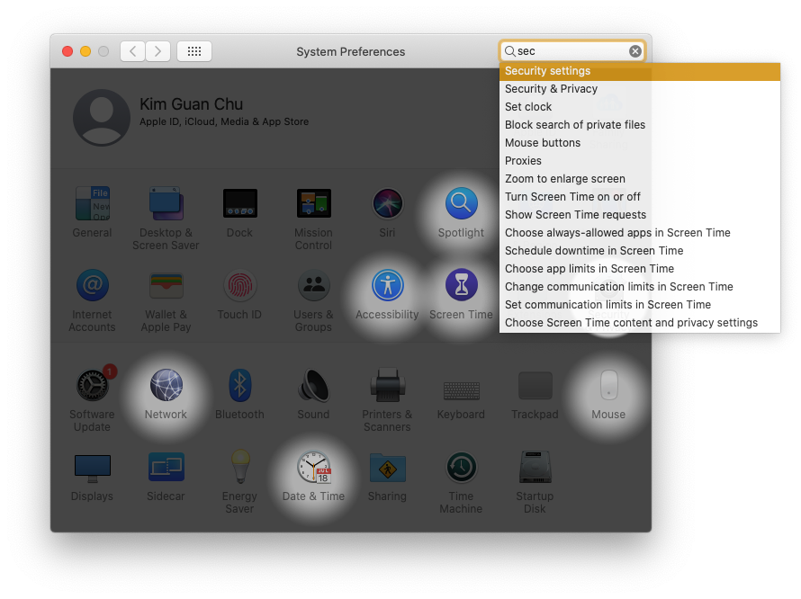  
   <i>Step 1. Go to your system preferences, and search for "Security & Privacy"</i>
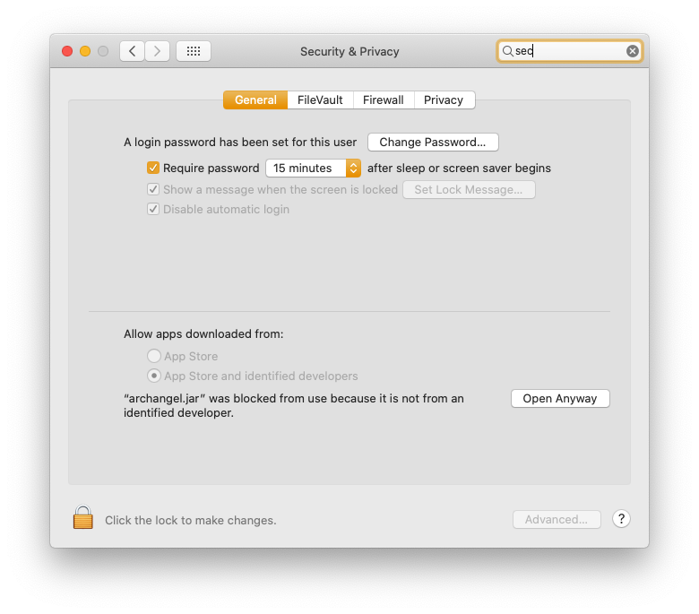  
   <i>Step 2. Under "Security & Privacy", click on "Open Anyway"</i>
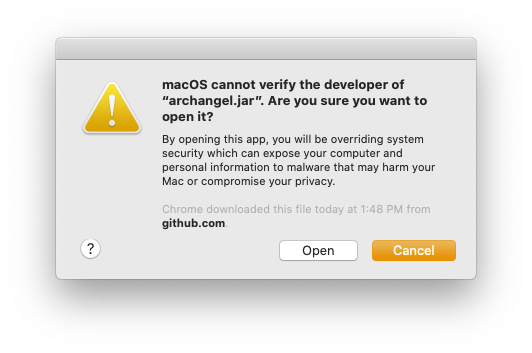  
   <i>Step 3. In the pop-out window,click on "Open" and you are done!</i>

--------------------------------------------------------------------------------------------------------------------

## Command summary

Action                               | Format, Examples | Compatible with `undo`
-------------------------------------|------------------------------------------------------------------------------ | ---------------------------------------
Add Patient                          | `p-add n/NAME g/GENDER bd/YYYY-MM-DD bt/BLOODTYPE p/PHONE_NUMBER e/EMAIL a/ADDRESS [t/TAG]…`​   e.g. `p-add n/John Doe g/MALE bd/2018-12-27 bt/A+ p/98765432 e/johnd@example.com a/311, Clementi Ave 2, #02-25` |  **YES**
List Patients                        | `p-list` | **NO**
Edit Patient                         | `p-edit INDEX [n/NAME] [p/PHONE_NUMBER] [e/EMAIL] [a/ADDRESS] [t/TAG]…​`   e.g. `p-edit 2 n/James Lee e/jameslee@example.com` | **NO**
Find Patient                         | `p-find KEYWORD [MORE_KEYWORDS]`   e.g. `p-find James Jake` | **NO**
Delete Patient                       | `p-delete INDEX`  e.g. `p-delete 3` | **YES**
Adding Patient Remark                | `p-remark INDEX r/REMARK`  e.g. `p-remark 1 r/Likes to swim.` | **YES**
Removing Patient Remark              | `p-remark INDEX`  e.g. `p-remark 3` | **YES**
Help                                 | `help` | **NO**
Schedule Appointment                 | `a-schedule pt/INDEXOFPATIENT start/DATE&TIME end/DATE&TIME d/DESCRIPTION [t/TAGS]…`​  e.g. `a-schedule pt/2 start/2020-11-21 08:00 end/2020-11-21 10:00 d/Review Appointment` | **YES**
Delete Appointment                   | `a-delete INDEX`  e.g. `a-delete 3` | **YES**
Edit Appointment                     | `a-edit INDEX [start/DATE&TIME] [end/DATE&TIME] [d/DESCRIPTION] [t/TAGS]…`   e.g. `a-edit 2 start/2020-09-15 12:00 end/2020-09-15 14:00` | **YES**
Complete Appointments                | `a-complete INDEX` | **YES**
List Upcoming Appointments           | `a-list` | **NO**
List All Appointments                | `a-listall` | **NO**
Find Appointments by Patient         | `a-find KEYWORD [MORE_KEYWORDS]`   e.g. `a-find Jack` | **NO**
Find Appointments by Tags            | `a-tag KEYWORD [MORE_KEYWORDS]`   e.g. `a-find friends` | **NO**
Find Appointments by Current Date    | `a-today` | **NO**
Find Appointments by Current Week    | `a-upcoming` | **NO**
List Appointments by Completed       | `a-completed`| **NO**
List Appointments by Missed          | `a-missed` | **NO**
Undo the previous command            | `undo` | **NO**
Redo the previous command            | `redo` | **NO**

--------------------------------------------------------------------------------------------------------------------

## Glossary

Term                                 | Definition
-------------------------------------|---------------------------------------------------------------------------|
Index                                | The position of an object in a list. The context of what object and list involved will be given whenever this term is used.
Command-Line Interface (CLI)         | A command-line interface (CLI) processes commands to a computer program in the form of lines of text.
Graphical User Interface (GUI)       | A graphical user interface allows users to interact with the application through graphical icons.
Archangel.jar                        | The executable file you double click to run Archangel
Folder                               | A folder is a storage space on your computer that store files
Directory                            | A directory is the reference to a specific folder on your computer. Windows e.g. `C:\Users\BestDoctor\Desktop` is the directory to your Desktop, while `C:\Users\BestDoctor\Desktop\Archangel` will be the directory to the folder called Archangel on your desktop. 

--------------------------------------------------------------------------------------------------------------------

