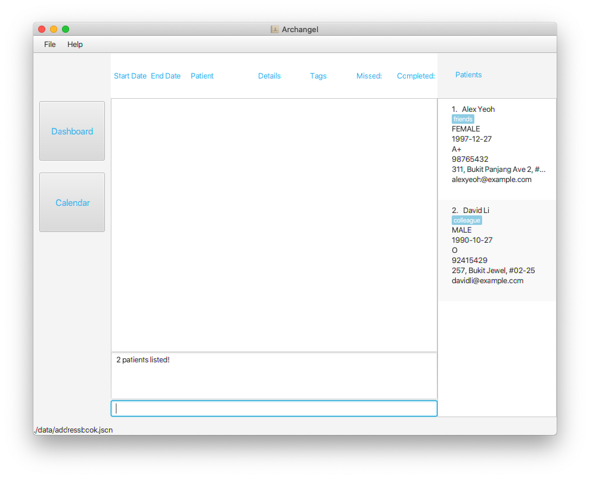

Archangel is a **desktop app for managing patient appointments, optimized for use via a Command Line Interface** (CLI) while still having the benefits of a Graphical User Interface (GUI). 
If you can type fast, Archangel can get your patient management appointment done faster than traditional GUI apps.

* Table of Contents
{:toc}

--------------------------------------------------------------------------------------------------------------------

## Quick start

1. Ensure you have Java `11` or above installed in your Computer.

1. Download the latest `archangel.jar` from [here](https://github.com/AY2021S1-CS2103T-W11-1/tp/releases).

1. Copy the file to the folder you want to use as the _home folder_ for your AddressBook.

1. Double-click the file to start the app. The GUI similar to the below should appear in a few seconds. Note how the app contains some sample data. 
   

1. Type the command in the command box and press Enter to execute it. e.g. typing **`help`** and pressing Enter will open the help window. 
   Some example commands you can try:

   * **`list`** : Lists all contacts.

   * **`add`**`n/John Doe g/MALE bd/2018-12-27 bt/A+ p/98765432 e/johnd@example.com a/311, Clementi Ave 2, #02-25` : Adds a Patient named `John Doe` to the Archangel.

   * **`delete`**`3` : Deletes the 3rd contact shown in the current list.

   * **`exit`** : Exits the app.

1. Refer to the [Features](#features) below for details of each command.

--------------------------------------------------------------------------------------------------------------------

## Features

**:information_source: Notes about the command format:** 

* Words in `UPPER_CASE` are the parameters to be supplied by the user. 
  e.g. in `add n/NAME`, `NAME` is a parameter which can be used as `add n/John Doe`.

* Items in square brackets are optional. 
  e.g `n/NAME [t/TAG]` can be used as `n/John Doe t/friend` or as `n/John Doe`.

* Items with `…`​ after them can be used multiple times including zero times. 
  e.g. `[t/TAG]…​` can be used as ` ` (i.e. 0 times), `t/friend`, `t/friend t/family` etc.

* Parameters can be in any order. 
  e.g. if the command specifies `n/NAME p/PHONE_NUMBER`, `p/PHONE_NUMBER n/NAME` is also acceptable.

### Viewing help : `help`

Shows a message explaning how to access the help page.

Format: `help`

### 1. Adding a patient: `add`

Adds a patient to the address book. 
Format: `add n/NAME g/GENDER bd/BIRTHDATE (in YYYY/MM/DD format) bt/BLOODTYPE p/PHONE_NUMBER e/EMAIL a/ADDRESS [t/TAG]…​`

:bulb: **Tip:**
A patient can have any number of tags (including 0)

Examples:
* `add n/John Doe p/98765432 e/johnd@example.com a/John street, block 123, #01-01`
* `add n/Betsy Crowe t/friend e/betsycrowe@example.com a/Newgate Prison p/1234567 t/criminal`

### 2. View a patient's information: `view`

View the patient's information stored in Archangel.

Format: `view n/NAME` 
* View the patient with the specified name 

### 3. Listing all patients : `list`

Shows a list of all patients in the address book.

Format: `list`

### 4. Editing a patient : `edit`

Edits an existing patient in the address book.

Format: `edit INDEX [n/NAME] [g/GENDER] [bd/BIRTHDATE] [bt/BLOODTYPE] [p/PHONE] [e/EMAIL] [a/ADDRESS] [t/TAG]…​`

* Edits the patient at the specified `INDEX`. The index refers to the index number shown in the displayed patient list. The index **must be a positive integer** 1, 2, 3, …​
* At least one of the optional fields must be provided.
* Existing values will be updated to the input values.
* When editing tags, the existing tags of the patient will be removed i.e adding of tags is not cumulative.
* You can remove all the patient’s tags by typing `t/` without
    specifying any tags after it.

Examples:
*  `edit 1 p/91234567 e/johndoe@example.com` Edits the phone number and email address of the 1st patient to be `91234567` and `johndoe@example.com` respectively.
*  `edit 2 n/Betsy Crower t/` Edits the name of the 2nd patient to be `Betsy Crower` and clears all existing tags.

### Locating patients by name: `find`

Finds patients whose names contain any of the given keywords.

Format: `find KEYWORD [MORE_KEYWORDS]`

* The search is case-insensitive. e.g `hans` will match `Hans`
* The order of the keywords does not matter. e.g. `Hans Bo` will match `Bo Hans`
* Only the name is searched.
* Only full words will be matched e.g. `Han` will not match `Hans`
* Persons matching at least one keyword will be returned (i.e. `OR` search).
  e.g. `Hans Bo` will return `Hans Gruber`, `Bo Yang`

Examples:
* `find John` returns `john` and `John Doe`
* `find alex david` returns `Alex Yeoh`, `David Li` 
  
  
### 5. Giving a patient a Remark : `remark`

Stores a remark under the patient's information.
Recommended usage would be to store Allergies, Preferences, etc. 

Format: `remark INDEX r/REMARK`

* Store a remark for the patient at the specified `INDEX`.
* The index refers to the index number shown in the displayed patient list.
* The index **must be a positive integer** 1, 2, 3, …​

Examples:
* `remark 1 r/ Likes to swim.` gives the 1st patient in the list a remark of `Likes to swim.`

### 6. Removing a patient's Remark : `remark`

Stores a remark under the patient's information.

Format: `remark INDEX`

* Removes the remark for the patient at the specified `INDEX`.
* The index refers to the index number shown in the displayed patient list.
* The index **must be a positive integer** 1, 2, 3, …​

Examples:
* `remark 1` removes the Remark of the 1st patient on the list.
  
### 7. Deleting a patient : `delete`

Deletes the specified patient from the Archangel.

Format: `delete INDEX`

* Deletes the patient at the specified `INDEX`.
* The index refers to the index number shown in the displayed patient list.
* The index **must be a positive integer** 1, 2, 3, …​

Examples:
* `list` followed by `delete 2` deletes the 2nd patient in the Archangel.
* `find Betsy` followed by `delete 1` deletes the 1st patient in the results of the `find` command.

### 7. Exiting the program : `exit`

Exits the program.

Format: `exit`

### 8. Saving the data

The Archangel data is saved in the hard disk automatically after any command that changes the data. There is no need to save manually.

## Coming soon in v1.2

### 1. Schedule a patient appointment : `schedule`

Schedules a new patient appointment in Archangel.

Format: `schedule i/INDEXOFPATIENT s/DATE&TIME e/DATE&TIME [desc/DESCRIPTION] [t/TAGS]`

* Schedules patient appointment for patient `NAME`.
* Optional `DESCRIPTION` for appointment.
* Appointment will be set to input `DATE` (format: YYYY-MM-DD) and `TIME` (format: HH-MM)

Examples:
* `schedule n/Kim Guan d/2020-09-14 t/08-00 desc/Review Appointment` schedules an appointment for patient Kim Guan on 2020-09-14 at 08-00 with appointment description Review Appointment
* `schedule n/Kim Guan d/2020-09-14 t/08-00` schedules an appointment for patient Kim Guan on 2020-09-14 at 08-00 with no appointment description

### 2. List all appointments : `appointmentlist`

### 3. Delete an appointment : `delete-a`

### 4. Find an appointment : `find-a`

### 5. Edit an appointment : `edit-a`

--------------------------------------------------------------------------------------------------------------------

## FAQ

**Q**: How do I transfer my data to another Computer? 
**A**: Install the app in the other computer and overwrite the empty data file it creates with the file that contains the data of your previous AddressBook home folder.

--------------------------------------------------------------------------------------------------------------------

## Command summary

Action | Format, Examples
--------|------------------
**Add** | `add n/NAME p/PHONE_NUMBER e/EMAIL a/ADDRESS [t/TAG]…​`   e.g., `add n/James Ho p/22224444 e/jamesho@example.com a/123, Clementi Rd, 1234665 t/friend t/colleague`
**View** | `view n/NAME ` e.g.,`view n/Kim Guan`
**Delete** | `delete INDEX`  e.g., `delete 3`
**Edit** | `edit INDEX [n/NAME] [p/PHONE_NUMBER] [e/EMAIL] [a/ADDRESS] [t/TAG]…​`  e.g., `edit 2 n/James Lee e/jameslee@example.com`
**Find** | `find KEYWORD [MORE_KEYWORDS]`  e.g., `find James Jake`
**List** | `list`
**Help** | `help`
