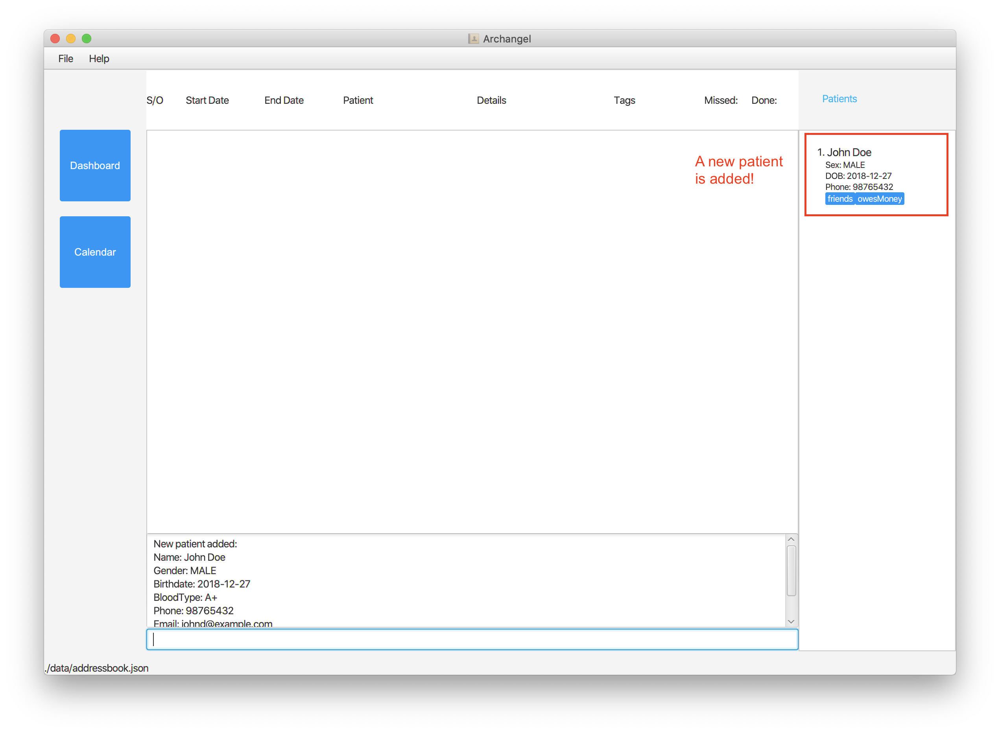
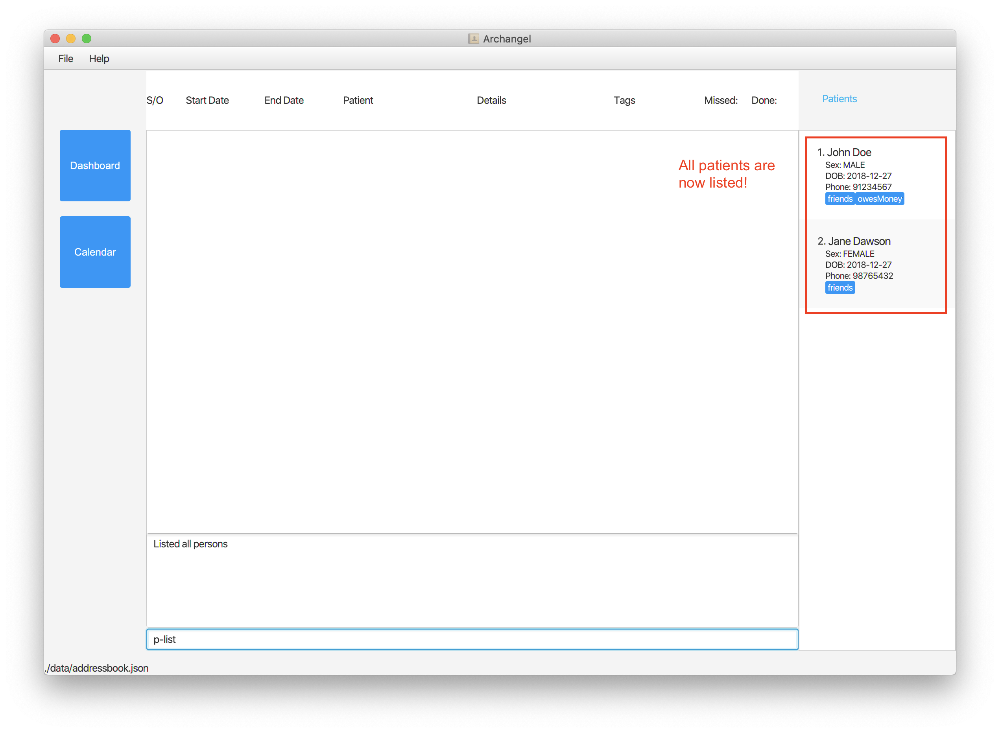
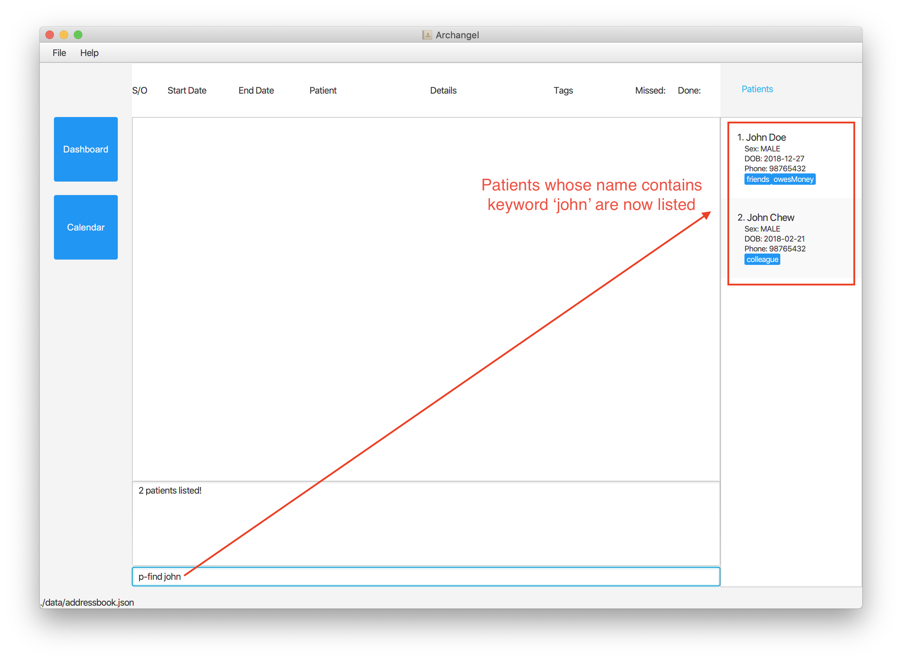
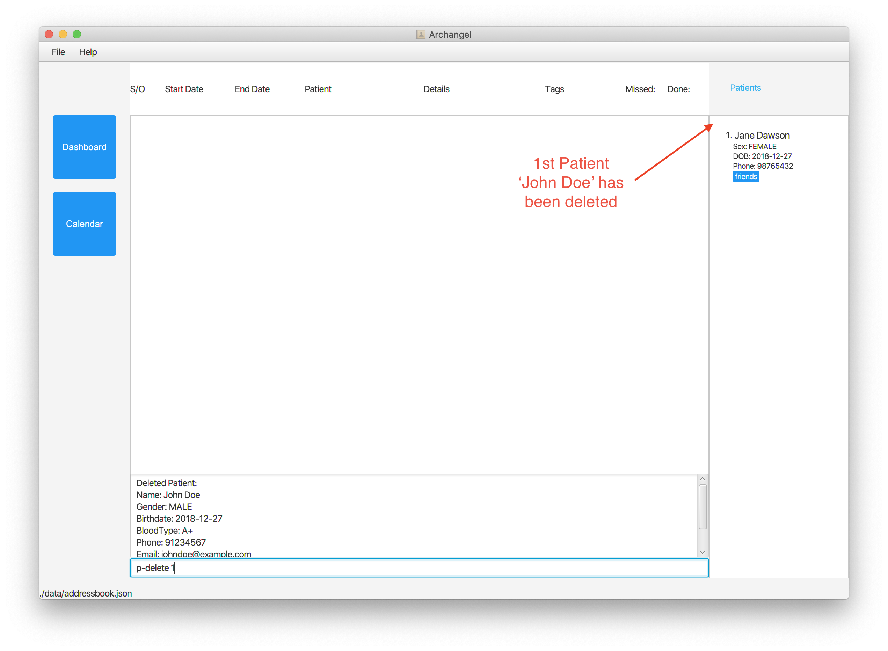
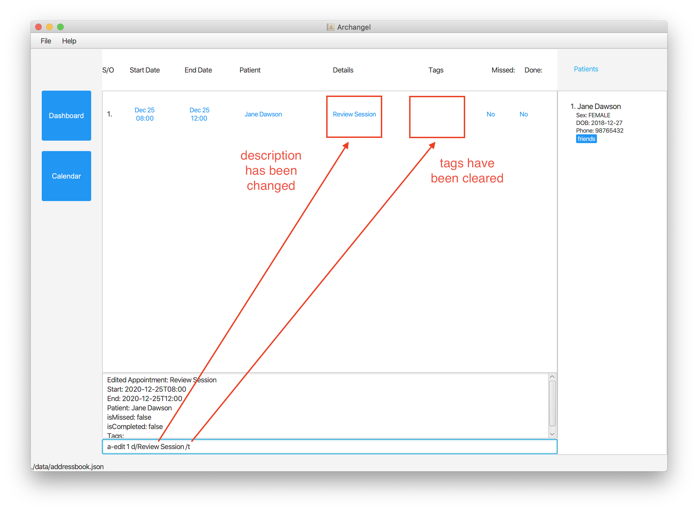

* Table of Contents
{:toc}

--------------------------------------------------------------------------------------------------------------------

## 1 Introduction

Archangel is a desktop application for managing patient appointments, optimized for use via a Command Line Interface (CLI) while still having the benefits of a Graphical User Interface (GUI).
Archangel integrates storing of patient data and scheduling patient appointments in a single application.
It supports adding, editing, deleting of patients/appointments and facilitates search using filter commands to help improve your experience in handling patient data.
If you can type fast, Archangel can get your patient management appointment done faster than traditional GUI apps.

  
  
Figure 0: <i>The user interface of Archangel.</i>

### 1.2 User Guide Icons

These are icons that are used throughout this User Guide for better readability:
- :bulb: — A useful tip for the users when using Archangel.
- :information_source: — A point for users to take note of.
- `code` — Indicates commands that will be type into the <i>command box</i> (see below)

### 1.3 Quick start

1. Ensure you have Java 11 or above installed in your Computer.

2. Download the latest `archangel.jar` from [here](https://github.com/AY2021S1-CS2103T-W11-1/tp/releases).

3. Copy the file to the folder you want to use as the _home folder_ for Archangel.

4. Double-click the file to start the app. The GUI similar to the below should appear in a few seconds. Note how the app contains some sample data. 
   

5. Type the command in the command box and press `Enter` to execute it. e.g. typing `help` and pressing `Enter` will open the help window. 
   Some example commands you can try:

   * `p-list` : Lists all patients.

   * `p-add n/John Doe g/MALE bd/2018-12-27 bt/A+ p/98765432 e/johnd@example.com a/311, Clementi Ave 2, #02-25` : Adds a Patient named John Doe to the Archangel.

   * `p-delete 3` : Deletes the 3rd patient shown in the current list.

   * `exit` : Exits the app.

6. Refer to the [Features](#features) below for details of each command.

--------------------------------------------------------------------------------------------------------------------

## 2. Features

### 2.1 General Features

**:information_source: Notes about the command format:** 

* Commands are identified by their quantifier type leading the actual command formatted as `{TYPE}-{COMMAND}`.
  * `p-{COMMAND}` - commands that acts on Patient-type data.
  * `a-{COMMAND}` - commands that acts on Appointment-type data.
    e.g. `p-delete` deletes a patient, `a-delete` deletes an appointment.

* Words in UPPER_CASE are the parameters to be supplied by the user. 
  e.g. in `p-add n/NAME`, `NAME` is a parameter which can be used as `p-add n/John Doe`.

* Items in square brackets are optional. 
  e.g `n/NAME [t/TAG]` can be used as `n/John Doe t/friend` or as `n/John Doe`.

* Items with `…`​ after them can be used multiple times including zero times. 
  e.g. `[t/TAG]…​` can be used as   (i.e. 0 times), `t/friend`, `t/friend t/family` etc.

* Parameters can be in any order. 
  e.g. if the command specifies `n/NAME p/PHONE_NUMBER`, `p/PHONE_NUMBER n/NAME` is also acceptable.

#### 2.1.1 Viewing help : `help`

Shows a message explaining how to access the help page.

Format: `help`

#### 2.1.2 Exiting the program : `exit`

Exits the program.

Format: `exit`

#### 2.1.3 Saving the data

The Archangel data is saved in the hard disk automatically after any command that changes the data. There is no need to save manually.

### 2.2 Patient Features

#### 2.2.1 Adding a patient: `p-add`

Adds a patient to Archangel.

Format: `p-add n/NAME g/GENDER bd/BIRTHDATE bt/BLOODTYPE p/PHONE_NUMBER e/EMAIL a/ADDRESS [t/TAG]…`​

* BIRTHDATE should be in YYYY/MM/DD format.
* BLOODTYPE can be only one of the following per patient: `A+`, `A-`, `B+`, `B-`, `O`, `O+`, `O-`, `AB+`, `AB-`

:bulb: Tip:
A patient can have any number of tags (including 0)

Examples:
* `p-add n/John Doe p/98765432 e/johnd@example.com a/John street, block 123, #01-01`
* `p-add n/Betsy Crowe t/friend e/betsycrowe@example.com a/Newgate Prison p/1234567 t/criminal`

#### 2.2.2 Listing all patients : `p-list`

Shows a list of all your patients in Archangel.

Format: `p-list`

#### 2.2.3 Editing a patient : `p-edit`

Edits an existing patient in the Archangel.

Format: `p-edit INDEX [n/NAME] [g/GENDER] [bd/BIRTHDATE] [bt/BLOODTYPE] [p/PHONE] [e/EMAIL] [a/ADDRESS] [t/TAG]…​`

* Edits the patient at the specified INDEX. The index refers to the index number shown in the displayed patient list. The index must be a positive integer 1, 2, 3, …​
* At least one of the optional fields must be provided.
* Existing values will be updated to the input values.
* When editing tags, the existing tags of the patient will be removed i.e adding of tags is not cumulative.
* You can remove all the patient’s tags by typing `t/` without specifying any tags after it.
* Note: Editing a patient will also update the patient in Appointments that contain the patient.

Examples:
* `p-edit 1 p/91234567 e/johndoe@example.com` Edits the phone number and email address of the 1st patient to be 91234567 and johndoe@example.com respectively.
* `p-edit 2 n/Betsy Crower t/` Edits the name of the 2nd patient to be Betsy Crower and clears all existing tags.

#### 2.2.4 Locating patients by name: `p-find`

Finds patients whose names contain any of the given keywords.

Format: `p-find KEYWORD [MORE_KEYWORDS]`

* The search is case-insensitive. e.g `hans` will match `Hans`
* The order of the keywords does not matter. e.g. `Hans Bo` will match `Bo Hans`
* Only the name will be searched.
* Only full words will be matched e.g. `Han` will not match `Hans`
* Persons matching at least one keyword will be returned (i.e. OR search).
  e.g. `Hans Bo` will return `Hans Gruber`, `Bo Yang`

Examples:
* `p-find John` returns `John Chew` and `John Doe`
* `p-find alex david` returns `Alex Yeoh`, `David Li` 

#### 2.2.5 Giving a patient a Remark : `p-remark`

Stores your remark under the patient's information.
Recommended usage would be to store Allergies, Preferences, etc.

Format: `p-remark INDEX r/REMARK`

* Store a remark for the patient at the specified INDEX.
* The index refers to the index number shown in the displayed patient list.
* The index must be a positive integer 1, 2, 3, …​

Examples:
* `p-remark 1 r/Likes to swim.` gives the 1st patient in the list a remark of `Likes to swim.`

#### 2.2.6 Removing a patient's Remark : `p-remark`

Removes all of your remarks under the patient's information.

Format: `p-remark INDEX`

* Removes all your remarks for the patient at the specified INDEX.
* The index refers to the index number shown in the displayed patient list.
* The index must be a positive integer 1, 2, 3, …​

Examples:
* `p-remark 1` removes the Remark of the 1st patient on the list.

#### 2.2.7 Deleting a patient : `p-delete`

Deletes the specified patient from the Archangel.

Format: `p-delete INDEX`

* Deletes the patient at the specified INDEX.
* The index refers to the index number shown in the displayed patient list.
* The index must be a positive integer 1, 2, 3, …​
* Note: Deleting a patient will also all Appointments that contains the deleted patient.

Examples:
* `p-list` followed by `p-delete 2` deletes the 2nd patient in the Archangel.
* `p-find Betsy` followed by `p-delete 1` deletes the 1st patient in the results of the find command.

### 2.3 Appointment Features

#### 2.3.1 Scheduling an appointment : `a-schedule`

Schedules a new patient appointment in Archangel.

Format: `a-schedule pt/INDEX start/DATE&TIME end/DATE&TIME d/DESCRIPTION [t/TAGS]…`

* Schedules patient appointment for patient at INDEX in the displayed patient list.
* Appointment will be set to input DATE (format: YYYY-MM-DD) and TIME (format: HH:MM).
* TAGS should be alphanumeric.
* Appointment time (i.e. duration from `start` to `end`) cannot overlap with another existing appointment.
* Appointment duration should not exceed 24 hours.
* Appointment time must be indicated as HH:MM (i.e. 9AM must be `09:00`, and not `9:00`).

Examples:
* `a-schedule pt/2 start/2020-09-14 08:00 end/2020-09-14 10:00 d/Review Appointment` schedules an appointment for patient 2 on 2020-09-14 at 08-00 with appointment description Review Appointment.

#### 2.3.2 Deleting an appointment : `a-delete`

Deletes the specified patient appointment from Archangel.

Format: `a-delete INDEX`

* Deletes the appointment at the specified INDEX.
* The index refers to the index number shown in the displayed appointment list.
* The index must be a positive integer 1, 2, 3, …​

Examples:
* `a-list` followed by `a-delete 2` deletes the 2nd appointment in the Archangel.
* `a-find Review` followed by `a-delete 1` deletes the 1st appointment in the results of the find command.

#### 2.3.3 Editing an appointment : `a-edit`

Edits the specified patient appointment that already exists in Archangel.

Format: `a-edit INDEX [start/DATE&TIME] [end/DATE&TIME] [pt/PATIENT INDEX] [d/DESCRIPTION] [t/TAGS]…`

* Edits the appointment at the specified INDEX. The index refers to the index number shown in the displayed appointment list. The index must be a positive integer 1, 2, 3, …​
* At least one of the optional fields must be provided.
* Existing values will be updated to the input values.
* When editing tags, the existing tags of the appointment will be removed i.e adding of tags is not cumulative.
* You can remove all the appointment’s tags by typing `t/` without specifying any tags after it.
* Tags must be alphanumeric and individual tags cannot be separated by spaces (i.e. `HighPriority` is a valid input, while `High Priority` is an invalid input).

Examples:
* `a-edit 1 start/2020-09-15 12:00 end/2020-09-15 14:00 pt/2` Edits the start and end date & time of the 1st appointment to be 15/9/2020 12:00 and 15/9/2020 14:00 respectively, and edits patient to 2nd patient in patient list.
* `p-edit 2 bd/1998-09-15 ` Edits the 2nd Patient on the PatientList to have a birthdate of 1998-09-15.

#### 2.3.4 Setting appointment as completed : `a-complete`

Sets the specified patient appointment in Archangel as completed.

Format: `a-complete INDEX`

* Edits the appointment at the specified INDEX.
* The index refers to the index number shown in the displayed appointment list.
* The index must be a positive integer 1, 2, 3, …​

Examples:
* `a-complete 1` Sets the appointment at index 1 as completed.

#### 2.3.5 Listing all upcoming appointments : `a-list`

Shows a list of all your uncompleted patient appointments in Archangel.

Format: `a-list`

#### 2.3.6 Listing all past and present appointments : `a-listall`

Shows a list of all your patient appointments in Archangel.

Format: `a-listall`

#### 2.3.7 Finding appointments by patient name : `a-find`

Finds your appointments which the patient's name contains any of the given keywords.

Format: `a-find KEYWORD [MORE_KEYWORDS]`

* The search is case-insensitive. e.g `jack` will match `Jack`
* The order of the keywords does not matter. e.g. `Jack Jill` will match `Jill Jack`
* Only the patient name inside the appointment is searched.
* Only full words will be matched e.g. `Jack` will not match `Jacky`
* Appointments matching at least one keyword will be returned (i.e. OR search).
  e.g. `Jack Jill` will return Appointments with Patient name of `Jack Sparrow`, `Jill Ous`

Examples:
* `a-find Jack` returns Appointment with Patient name of `Jack Sparrow`
* `a-find Jack Jill` returns Appointments with Patient name of `Jack Sparrow` and `Jill Ous`

#### 2.3.8 Finding appointments by tags: `a-tag`
Finds your appointments which are tagged by any of the given keywords.

Format: `a-find KEYWORD [MORE_KEYWORDS]`

* The search is case-insensitive. e.g `friends` will match `Friends`
* The order of the keywords does not matter. e.g. `friends enemy` will match `Friends Enemy`
* Only the tags inside the appointment will be searched.
* Only full words will be matched e.g. `Friend` will not match `Friends`
* Appointments matching at least one keyword will be returned (i.e. OR search).
  e.g. `friends enemy` will return Appointment tagged with `Friends`, `Jill Ous`

Examples:
* `a-tag friend` returns Appointments tagged `Friend`
* `a-tag friend enemy`  returns Appointments tagged `Friend` and `Enemy`

#### 2.3.9 Finding an appointment by current date: `a-today`
Finds your uncompleted appointments scheduled on the current date.

Format: `a-today`

Examples:
* `a-today` returns Appointments scheduled today.

#### 2.3.10 Finding an appointment by current week: `a-upcoming`
Finds your uncompleted appointments scheduled in the current week.

Format: `a-upcoming`

Examples:
* `a-upcoming` returns Appointments scheduled this week (from Sunday to Saturday).

#### 2.3.11 Listing appointments that are completed: `a-completed`
Shows a list of all your appointments that have been completed.

Format: `a-completed`

#### 2.3.12 Listing appointments that are missed: `a-missed`
Shows a list of all your appointments that have been missed.

Format: `a-missed`

### 2.4 General Commands

#### 2.4.1 Undoing the previous command : `undo`
"Oops, I accidentally deleted the wrong appointment!", fret not! You can undo your commands through the command `undo`

:information_source: **Things to Note:**   
* This command has no keywords   
* This command does not work with filter commands (`a-completed`,`a-missed`,`a-upcoming`,`a-today`,`a-find`,`a-list`)   
  as its implementation purpose is to assist the user in undo-ing his changes, filter commands do not make changes to the data.   
  It also does not work with `p-edit` as the design requires patient details to be accurate as of time schedule, such that the  
  records can accurately reflect the patient's conditions at the time of the appointment.  
* A list of commands that can be undone can be found in the table under Command Summary.   
* This command can be succeeded by a `redo` command

Format: `undo`

Examples:
* `p-delete 2` followed by `undo` undoes the edit command and make no changes to Archangel.

  
Figure 2.4.1.1: <i>Before `a-delete 1`.</i>
  
Figure 2.4.1.2: <i>After `a-delete 1`(James is gone!).</i>
  
Figure 2.4.1.3: <i>After `undo`(James is back!).</i>

#### 2.4.2 Redoing the previous command : `redo`
When there is an `undo`, there is always a `redo`! You can always `redo` commands that you `undo` previously!

:information_source: **Things to Note:**   
* This command has no keywords   
* This command must be preceded by `undo`

Format: `redo`

Examples:
* `p-delete 1` followed by `undo` then `redo` redoes the `undo` command and carries out the delete command.

  
Figure 2.4.2.1: <i>After `a-delete 1`(James is gone!).</i>
  
Figure 2.4.2.2: <i>After `undo`(James is back!).</i>
  
Figure 2.4.2.3: <i>After `redo`(James is gone!).</i>

--------------------------------------------------------------------------------------------------------------------

## FAQ

Q: How do I transfer my data to another Computer? 
A: Install the app in the other computer and overwrite the empty data file it creates with the file that contains the data of your previous Archangel home folder.

--------------------------------------------------------------------------------------------------------------------

## Command summary

Action                               | Format, Examples | Compatible with `undo`
-------------------------------------|------------------------------------------------------------------------------ | ---------------------------------------
Add Patient                          | `p-add n/NAME g/GENDER bd/YYYY-MM-DD bt/BLOODTYPE p/PHONE_NUMBER e/EMAIL a/ADDRESS [t/TAG]…`​   e.g. `p-add n/John Doe g/MALE bd/2018-12-27 bt/A+ p/98765432 e/johnd@example.com a/311, Clementi Ave 2, #02-25` |  **YES**
List Patients                        | `p-list` | **NO**
Edit Patient                         | `p-edit INDEX [n/NAME] [p/PHONE_NUMBER] [e/EMAIL] [a/ADDRESS] [t/TAG]…​`   e.g. `p-edit 2 n/James Lee e/jameslee@example.com` | **NO**
Find Patient                         | `p-find KEYWORD [MORE_KEYWORDS]`   e.g. `p-find James Jake` | **NO**
Delete Patient                       | `p-delete INDEX`  e.g. `p-delete 3` | **YES**
Adding Patient Remark                | `p-remark INDEX r/REMARK`  e.g. `p-remark 1 r/Likes to swim.` | **YES**
Removing Patient Remark              | `p-remark INDEX`  e.g. `p-remark 3` | **YES**
Help                                 | `help` | **NO**
Schedule Appointment                 | `a-schedule pt/INDEXOFPATIENT start/DATE&TIME end/DATE&TIME d/DESCRIPTION [t/TAGS]…`​  e.g. `a-schedule pt/2 start/2020-11-21 08:00 end/2020-11-21 10:00 d/Review Appointment` | **YES**
Delete Appointment                   | `a-delete INDEX`  e.g. `a-delete 3` | **YES**
Edit Appointment                     | `a-edit INDEX [start/DATE&TIME] [end/DATE&TIME] [d/DESCRIPTION] [t/TAGS]…`   e.g. `a-edit 2 start/2020-09-15 12:00 end/2020-09-15 14:00` | **YES**
Complete Appointments                | `a-complete INDEX` | **YES**
List Upcoming Appointments           | `a-list` | **NO**
List All Appointments                | `a-listall` | **NO**
Find Appointments by Patient         | `a-find KEYWORD [MORE_KEYWORDS]`   e.g. `a-find Jack` | **NO**
Find Appointments by Tags            | `a-tag KEYWORD [MORE_KEYWORDS]`   e.g. `a-find friends` | **NO**
Find Appointments by Current Date    | `a-today` | **NO**
Find Appointments by Current Week    | `a-upcoming` | **NO**
List Appointments by Completed       | `a-completed`| **NO**
List Appointments by Missed          | `a-missed` | **NO**
Undo the previous command            | `undo` | **NO**
Redo the previous command            | `redo` | **NO**

